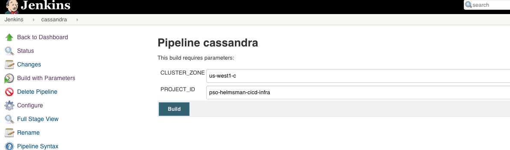
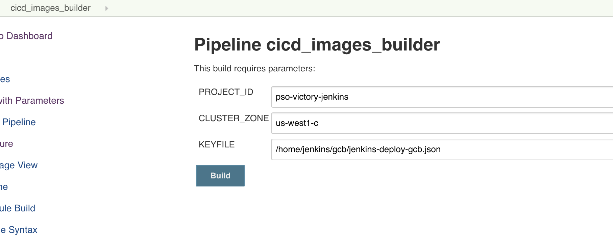
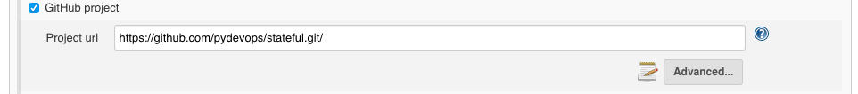

- [Infrastructure CICD pipeline](#infrastructure-cicd-pipeline)
    - [Set up Jenkins](#set-up-jenkins)
    - [Set up Cassandra with Jenkins](#set-up-cassandra-with-jenkins)
    - [Set up cicd-images scheduled job in Jenkins](#set-up-cicd-images-scheduled-job-in-jenkins)
    - [Snapshot Regional PD](#snapshot-regional-pd)
    - [How to setup GitHub Pull Request Builder Plugin](#how-to-setup-github-pull-request-builder-plugin)
    - [How to set up Google login](#how-to-set-up-google-login)
    - [How to set the Jenkins timezone](#how-to-set-the-jenkins-timezone)
- [Issues and workaround](#issues-and-workaround)
    - [pinning most important Jenkins plugins version](#pinning-most-important-jenkins-plugins-version)
    - [Github webook and Jenkins integration](#github-webook-and-jenkins-integration)
    - [Job failed prematurely](#job-failed-prematurely)

## Infrastructure CICD pipeline
The objective is to use Jenkins pipelines for infrastructure for the same reasons that development teams use pipelines for their application code. It guarantees that every change has been applied to each environment, and that automated tests have passed. We know that all the environments are defined and created consistently. In our demo, only testing environment is considered.

This demo is developed based on the `helmsman-cardinal-jenkins` and `helmsman-cardinal-stateful` demos.

### Set up Jenkins
Set up Jenkins according to the `helmsman-cardinal-jenkins`
 original README. As we only need one project for testing, we only use `dev` project. Only the differences are highlighted here:
 * Run `./scripts/setup-dev-infra.sh` to set up CICD for GCP infrastructure in a dev cluster, this implies a number of more powerful IAM permissions would be granted for creating, managing and destroying infrastructure.

### Set up Cassandra with Jenkins
1. Create a google source repo for Cassandra demo from `helmsman-cardinal-stateful`:
    1. run `./scripts/create-google-repo.sh -d location_of_cassandra_demo_repo -n stateful`. Please note the `cassandra_demo` should not contain any `.git`. for this to work.
2. Jenkins job in Jenkins
    1. in Jenkins UI, create a job `cassandra` as `pipeline` type.
    2. set `https://source.developers.google.com/p/${JENKINS_PROJECT}/r/cassandra` as git source url.
    3. Run "Build Now" in Jenkins UI with all the parameters needed by the Jenkinsfile.

### Set up cicd-images scheduled job in Jenkins
The objective is to build all docker images and push them to `gcr.io/pso-helmsman-cicd` on a scheduled basis.

1. `./scripts/setup-jenkins-gcb.sh` sets up the service account for trigger Container Builder job in JENKINS_PROJECT.
2. Create a google source repo from `cicd-images` in JENKINS_PROJECT.
    1. run `./scripts/create-google-repo.sh -d location_of_cicd_images -n cicd-images`. Please note the `cicd-images` should not contain any `.git` for this to work.
3. Set up a Jenkins job in Jenkins
    1. in Jenkins UI, create a job `cicd_images_builder` as `pipeline` type.
    2. set `https://source.developers.google.com/p/${JENKINS_PROJECT}/r/cicd-images` as git source url.
    3. Under "Build Triggers", set "Build periodically" 's schedule as `0 0 * * *`, i.e a daily midnight job.
    4. Set up all the parameters needed by the Jenkinsfile.

### Snapshot Regional PD 
`snapshot` can be useful for recovery. 

### How to setup GitHub Pull Request Builder Plugin
Please read *ghprb-plugin.md* as this plugin worth its own README.md. 

### How to set up Google login
1. Install [Google Login Plugin](https://wiki.jenkins.io/display/JENKINS/Google+Login+Plugin)
2. [configure Jenkins with Google Oauth](http://www.tothenew.com/blog/jenkins-google-authentication/)

### How to set the Jenkins timezone
In the `jenkins-statefulset.yaml`, please set `-Dorg.apache.commons.jelly.tags.fmt.timeZone=America/Los_Angeles` in the JAVA_OPTS. 

## Issues and workaround

### pinning most important Jenkins plugins version
`manifests/jenkins-configmap` has the list of plugins that needs to locked down once the versions are proven working. Only upgrade for bug fixes or desired features. 

### Github webook and Jenkins integration
James M. and Victor Y. have been investigated the issue today. A fair statement is we accidentally makes to work.  I was poking around the jenkins container by checking its log files, all of sudden that triggers the UI update and the rest. The push event works (not PR request).  Not sure what to write for tracking this. I suspect Jenkins relies on some file's access timestamp or something, as some of you might know docker file system is different. such as ran into running cron job on docker before due to hardlink (https://github.com/phusion/baseimage-docker/issues/198).

### Job failed prematurely
Ran into a issue https://issues.jenkins-ci.org/browse/JENKINS-48300, the cassandra job failed during the run, showing the error message (JENKINS-48300: if on a laggy filesystem, consider -Dorg.jenkinsci.plugins.durabletask.BourneShellScript.HEARTBEAT_CHECK_INTERVAL=300)

Upgraded the durabletask plugin to 1.25 from 1.24. The issue goes away.

 
