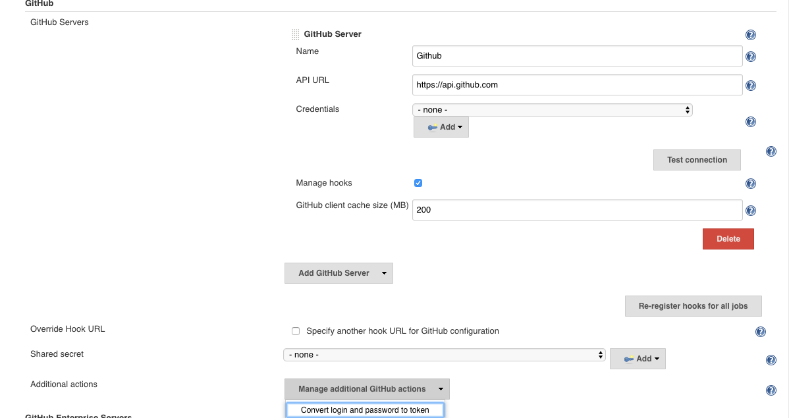
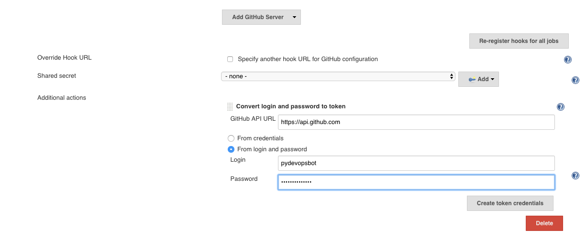
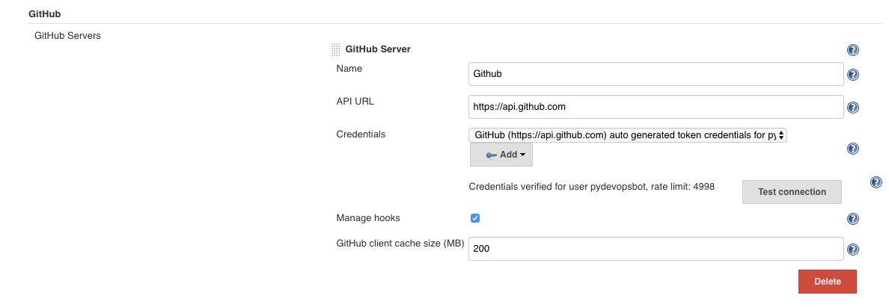
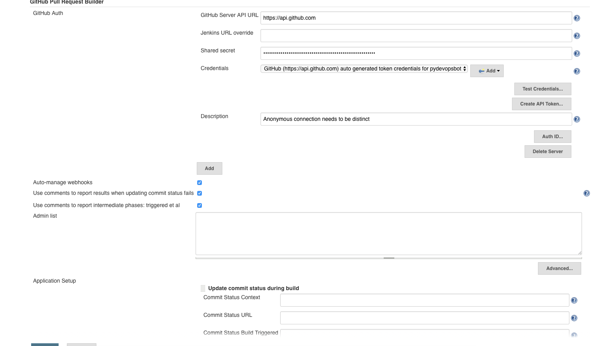
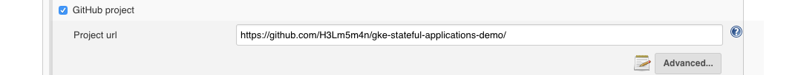
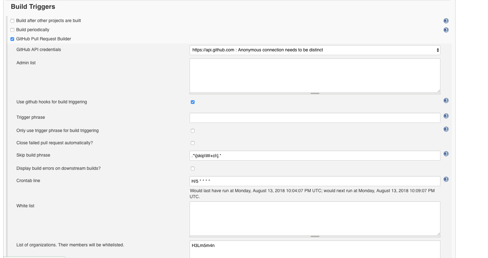
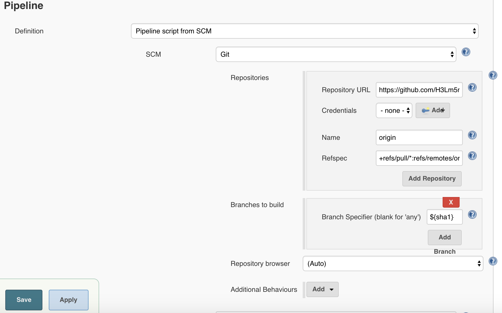

## Create Github bot user
You will need to create a GitHub user account for Jenkins. (ex: jenkins_github_bot) This will also require you to create an email account for Jenkins. Save these usernames in a secure location.

## Manage Jenkins System configuration

### github plugin configuration

- set the server api URL in ``GitHub server api URL`` as ``https://api.github.com``
- A GitHub API token or username password can be used for access to the GitHub API
- To setup credentials for a given GitHub Server API URL:
  - Click Add next to the ``Credentials`` drop down
    - For a token select ``Kind`` -> ``Secret text``
      - If you haven't generated an access token you can generate one in ``Test Credentials...``
        - Set your 'bot' user's GitHub username and password.
        - Press the ``Create Access Token`` button
        - Jenkins will create a token credential, and give you the id of the newly created credentials. The default description is: ``serverAPIUrl + " GitHub auto generated token credentials"``.
    - For username/password  ``Kind`` -> ``Username with password``
  - Credentials will automatically be created in the domain given by the ``GitHub Server API URL`` field.
  - Select the credentials you just created in the drop down.
  - The first fifty characters in the Description are used to differentiate credentials per job, so again use something semi-descriptive

### ghprb plugin configuration
Please make sure to choose "Auto manage webhooks". A webhook such as `https://ci.gflocks.com/ghprbhook/` for a given repo would be created once the job triggers.

## Job level configuration

### set project's Git url

### Build Trigger
Please make sure the organization is whitelisted. The rest of configurations use the default values.

### Pipeline

