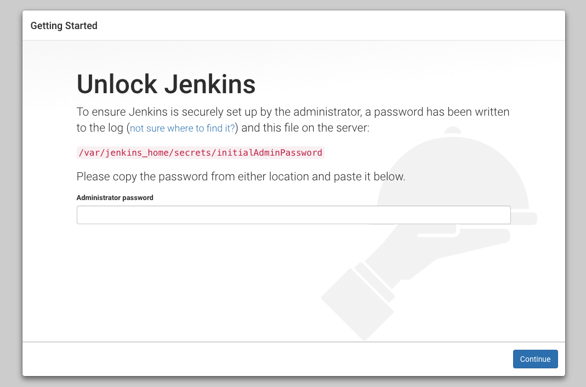
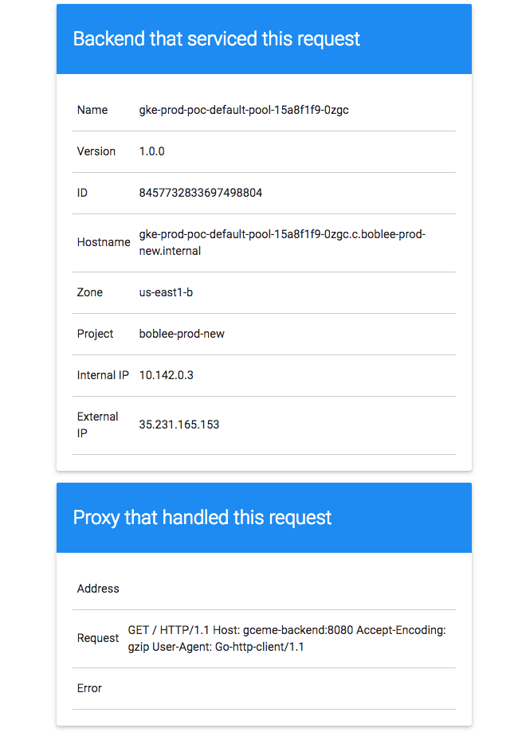

# Deploying to Multiple Clusters using Jenkins in Kubernetes Engine

## Table of Contents

<!--ts-->
* [Introduction](#introduction)
* [Architecture](#architecture)
   * [Jenkins Kubernetes Engine cluster](#jenkins-kubernetes-engine-cluster)
   * [Jenkins master deployment in Kubernetes](#jenkins-master-deployment-in-kubernetes)
   * [Jenkins plugins](#jenkins-plugins)
   * [Jenkins pipeline](#jenkins-pipeline)
* [Prerequisites](#prerequisites)
   * [Tools](#tools)
   * [Versions](#versions)
* [Deployment Steps](#deployment-steps)
   * [Create Jenkins Kubernetes Engine Cluster](#create-jenkins-kubernetes-engine-cluster)
   * [Access Jenkins UI and initial setup](#access-jenkins-ui-and-initial-setup)
   * [Create a private Jenkins node container image](#create-a-private-jenkins-node-container-image)
   * [Create Cloud Source Repositories for the sample app](#create-cloud-source-repositories-for-the-sample-app)
   * [Create the Deployment clusters](#create-the-deployment-clusters)
   * [Create a build pipeline in Jenkins](#create-a-build-pipeline-in-jenkins)
      * [Add service account credentials](#add-service-account-credentials)
      * [Setup Kubernetes Plugin](#setup-kubernetes-plugin)
      * [Create a Build Job](#create-a-build-job)
* [Validation](#validation)
* [Tear Down](#tear-down)
   * [Tear down everything](#tear-down-everything)
      * [Tear down Jenkins Kubernetes Engine cluster](#tear-down-jenkins-kubernetes-engine-cluster)
      * [Tear down deployment Kubernetes Engine cluster and remove service account](#tear-down-deployment-kubernetes-engine-cluster-and-remove-service-account)
      * [Tear down Cloud Source Repositories and Container Registry](#tear-down-cloud-source-repositories-and-container-registry)
* [Troubleshooting](#troubleshooting)
   * [Not have enough resources available to fulfill the request.](#not-have-enough-resources-available-to-fulfill-the-request)
   * [Jenkins build errors showing in console logs](#jenkins-build-errors-showing-in-console-logs)
* [Relevant Material](#relevant-material)
<!--te-->

## Introduction

Jenkins is an open-source automation server that lets you flexibly orchestrate
your build, test, and deployment pipelines. Kubernetes Engine is a hosted
version of Kubernetes, a powerful cluster manager and orchestration system for
containers.

This guide will take you through the steps on how to setup
[Jenkins](https://jenkins.io/) running on a
[Kubernetes Engine](https://cloud.google.com/kubernetes-engine/) (Kubernetes Engine) Cluster.
Jenkins build nodes will be dynamically provisioned into the Kubernetes cluster
so they will only be utilized when a build is actively running.  This will give
you ephemeral build nodes that allow each build to run in a clean environment
while freeing up resources when a build is not running. The build nodes will use
Google Cloud Platform (GCP) service accounts to deploy a sample app to
Kubernetes clusters hosted in other GCP projects.

Typical Kubernetes Jenkins setups build and deploy to the same cluster.  This
demo will demonstrate how to use a Jenkins pipeline, GCP service accounts, Cloud
Source Repositories, and Container Registry to deploy multiple clusters.

Scripts are provided to automate the creation and deletion of necessary
resources.  The scripts are safe to run multiple times since they will validate
if the resources have already been created. The Jenkins node container image is
built with the included Dockerfile.  The sample app that we will be deploying is
also contained in this project.

## Architecture
We will be creating three separate Google Cloud projects.  Each project will be
running a Kubernetes Engine Cluster.  One cluster will be running Jenkins with the dynamically
provisioned build nodes.  The other clusters will be a production and
development cluster running the sample app.

Access to the Jenkins UI will be going through a Kubernetes ingress which
creates a public endpoint using the GCP load balancer with a self signed ssl
cert.

Source code for the sample app will be stored in GCP source repositories in the
Jenkins GCP project.

Docker images will be pushed to and pulled from the Google Container Registry.

A GCP service account will be created in each of the production and development
GCP projects and have access to the Cloud Source Repositories and Container
Registry in the Jenkins GCP project.  Access will be managed using IAM roles.

### Jenkins Kubernetes Engine cluster
When deploying a Kubernetes Engine cluster, we need to specify the scope
https://www.googleapis.com/auth/source.read_write so our cluster has access to
Cloud Source Repositories.

The Jenkins google-source-plugin requires the legacy scope
https://www.googleapis.com/auth/projecthosting so we will also include it.  An
upcoming release of that plugin should remove that dependency so only
https://www.googleapis.com/auth/source.read_write will be required.

This is done in the `create-jenkins-cluster.sh` build script by passing in the
`--scopes` flag to gcloud container clusters create
```shell
  gcloud container clusters create ${JENKINS_CLUSTER_NAME} \
    --cluster-version ${GKE_VERSION} \
    --num-nodes 3 \
    --enable-autorepair \
    --zone ${ZONE} \
    --scopes "https://www.googleapis.com/auth/source.read_write,https://www.googleapis.com/auth/projecthosting"
```

### Jenkins master deployment in Kubernetes
The following image describes the architecture for deploying Jenkins in a
multi-node Kubernetes cluster.


To setup the Jenkins master we will use the following Kubernetes resources:

- ConfigMap - Used to create a file with a list of necessary Jenkins plugins to
  install

- StatefulSet - Will be used to manage our deployment so Jenkins is stateful by
  saving data to a persistent volume

- RBAC - Using ServiceAccount, ClusterRole, and ClusterRoleBindings to set
  permissions

- Services - Service discovery for our UI and node agent communication

- Ingress - External load balancing and SSL termination for our external service

- Secrets - Secure storage of the SSL certificate and private keys for service
  accounts

### Jenkins plugins
The following Jenkins plugins will be required that are not part of the
`Install suggested Plugins` in setup.

- [Kubernetes Plugin](https://github.com/jenkinsci/kubernetes-plugin)
  (kubernetes) - Start Jenkins build executor containers in the Kubernetes
  cluster when builds are requested, terminate those containers when builds
  complete, freeing resources up for the rest of the cluster

- [Google Source Plugin](https://github.com/jenkinsci/google-source-plugin)
  (google-source-plugin) - This plugin provides the credential provider to use
  Google Cloud Platform OAuth Credentials

The plugins above will automatically be installed by a Kubernetes initContainers
during the Jenkins deployment.  To add more plugins to be automatically
installed add them to the manifests/jenkins-configmap.yaml file.  That file will
create a plugin.txt in a configmap what will get mounted to the Jenkins
container. The initContainers will run a script to install all plugins listed in
plugin.txt

### Jenkins pipeline
A [continuous delivery pipeline](https://jenkins.io/doc/book/pipeline/) will be
defined in a text file called a Jenkinsfile.  The Jenkinsfile can be committed
to a project's source control.  This is the foundation of "Pipeline-as-code"
which treats the pipeline as code therefore can be versioned and reviewed.

A Jenkinsfile can be written using two types of syntax: Declarative and
Scripted.  Our pipeline will be using the declarative pipeline syntax and will
also be used to define the build node in the Jenkins cluster.  The Kubernetes
plugin podTemplate is setup in the Jenkinsfile using yaml so we do not have to
configure it through the Jenkin UI.

The steps in our pipeline are:
1.  Set up the docker image version using the Jenkins build number

1.  Set up kubectl access to the deployment clusters using a service account in
    their project. The master branch will get access to the production cluster
    and all others will have access to the development cluster.

1.  Set up docker with credential to access the Google Container Registry in the
    Jenkins project

1.  Pull down the sample-app source code from Cloud Source Repositories

1.  Build the docker image

1.  Run test against that image

1.  Push the new version of the docker image to the Google Container Registry

1.  Update the docker image in the application's Kubernetes deployment manifest

1.  Use kubectl to deploy the application to the correct cluster

1.  Output the endpoint to access the sample application

1.  Revoke access to the service account

1.  Terminate the build node

## Prerequisites
A Google Cloud account and access to create multiple projects is required for
this demo.  The projects must have the proper quota to run a Kubernetes Engine cluster with
n1-standard-4 nodes.

### Tools
1.  gcloud cli
1.  kubectl
1.  bash or bash compatible shell
1.  Docker
1.  watch
1.  git

### Versions
1.  Kubernetes Engine latest version
2.  kubectl that matches Kubernetes Engine version
3.  gcloud - Google Cloud SDK 200.0.0

More recent versions of all the tools may function, please feel free to file an
issue if you encounter problems with newer versions.

## Deployment Steps

To deploy the demo execute the following commands.

```shell
git clone # TODO with correct url when we move into GitHub
cd gke-jenkins-demo
```

Create three GCP projects. A Jenkins, production, and development project.  You
can find instructions on how to create a project
[here](https://cloud.google.com/resource-manager/docs/creating-managing-projects)

### Create Jenkins Kubernetes Engine Cluster

Edit the file `scripts/jenkins.properties` and update these variables:
- `JENKINS_PROJECT` with the Jenkins GCP project ID.
- `DEV_PROJECT` with the development GCP project ID.
- `PROD_PROJECT` with the production GCP project ID.

Take a look at the other variables to get familiar with them.  They are optional
if you want to change them. If you do not have a default compute zone configured
for gcloud, you will either need to set it or change the ZONE variable.

The following script will create a Jenkins Kubernetes Engine cluster.
```shell
./scripts/create-jenkins-cluster.sh
```

This script could take a while to run. The variables JENKINS_PROJECT,
JENKINS_CLUSTER_NAME, ZONE will be used from the jenkins.properties file.
You can override them by passing in the flags -p, -c, and -z respectively

The last lines of the output will be:
```shell
waiting for external ip from ingress

 Access Jenkins using this url https://<your external ip>
```

If the url doesn't load it could be that we are still waiting for the
load balancer to pass it's health checks. To check on the status, go to
the cloud console and then go to `Network services` -> `Load balancing` and then
click on the jenkins load balancer.  In the backend services section, wait until
the healthy column has 1/1 for all the nodes.

### Access Jenkins UI and initial setup

Go to the url provided above.  You will get a connection is not private warning
since we're using a self signed certificate.  Since this is your first time
accessing Jenkins, it will prompt you to "Unlock Jenkins"



Run the command below to get your initial Administrator password for Jenkins.
```shell
kubectl exec $(kubectl get pods -n jenkins -l app=jenkins -o \
  jsonpath='{.items[0].metadata.name}') -n jenkins cat \
  /var/jenkins_home/secrets/initialAdminPassword
```

Copy the returned value to the `Administrator password` box and hit the continue
button.

In the next screen `Customize Jenkins` click on the `Install suggested Plugins`
box. The list of installed suggested plugins can be found [here](https://github.com/jenkinsci/jenkins/blob/master/core/src/main/resources/jenkins/install/platform-plugins.json)


Complete the information to create the first admin user and then hit the
`Save and Continue` button. Use a secure password since this url is publicly
exposed.


On the next screen `Instance Configuration` the `Jenkins URL:` field should
already be populated so just hit `Save and Finish` and then the
`Start using Jenkins` button.

### Create a private Jenkins node container image

We will now create our own Jenkins node image based off the Jenkins image
[jenkins/jnlp-slave](https://github.com/jenkinsci/docker-jnlp-slave).  Our
Dockerfile adds the Google Cloud SDK to the image.

Build our Jenkins node image
```shell
source scripts/jenkins.properties
docker build -t gcr.io/$JENKINS_PROJECT/jenkins-k8s-node:1.0.0 \
jenkins-node-container
```

To authenticate to the Container Registry, run the gcloud a Docker credential
helper
```shell
gcloud auth configure-docker
```

Push our image to the Container Registry in our Jenkins project
```shell
docker push gcr.io/$JENKINS_PROJECT/jenkins-k8s-node:1.0.0
```

The `jenkins-k8s-node` image is now ready to be pulled from your private docker
registry.  You can also still choose to pull from the public registry at
gcr.io/pso-examples/jenkins-k8s-node

### Create Cloud Source Repositories for the sample app

Here you will create your own copy of the gceme sample app in
[Cloud Source Repositories](https://cloud.google.com/source-repositories/docs/).
The sample app source can be found in the `sample-app` directory in the project.

1.  Ensure your git is setup
    ```shell
    git config --global user.email "YOUR-EMAIL-ADDRESS"
    git config --global user.name "YOUR-NAME"
    ```
    If the wrong account is being used the values above could be overridden by
    an entry in ~/.netrc

1.  Run the script create-repo.sh script

    This script will update the Jenkinsfile based on the values set in the
    jenkins.properties file, create a repository in Cloud Source Repositories in
    your Jenkins project and push the sample app files to source control

    ```shell
    ./scripts/create-repo.sh
    ```

    The last lines of the output will be:

    ```shell
    Compressing objects: 100% (11/11), done.
    Writing objects: 100% (11/11), 6.00 KiB | 2.00 MiB/s, done.
    Total 11 (delta 3), reused 0 (delta 0)
    remote: Resolving deltas: 100% (3/3)
    To https://source.developers.google.com/p/<jenkins project>/r/sample-app
    * [new branch]      master -> master
    ```

### Create the Deployment clusters

We will be building two Kubernetes Engine clusters `development` (dev) and `production` (prod)
to deploy our sample app to.  Each cluster will be in it's own GCP project.

To build the deployment clusters you will need to execute the
`create-deployment-cluster.sh` script and pass in the environment with -e.  The
script will read in the DEV_PROJECT and PROD_PROJECT variables from the
`scripts/jenkins.properties` file.  Run the scripts one at a time.

To build the development cluster run
```shell
./scripts/create-deployment-cluster.sh -e dev
```

To build the production cluster run
```shell
./scripts/create-deployment-cluster.sh -e prod
```

The script will create the Kubernetes Engine cluster and create a Kubernetes namespace that
matches the environment name.  Create a GCP service account that Jenkins will
use to access that cluster.  It will also grant permissions to the service
accounts to access the Container Registry in the Jenkins project to pull
container images from.

The cluster name and service account will be set based on the environment.
Below is the logic that it uses:

```shell
CLUSTER_NAME=$ENV-poc
SA_NAME=jenkins-deploy-$ENV
```

A service account private key will be created and saved in the root directory
with the name set to the variable SA_NAME.json .  The script will then switch
over to your Jenkins Kubernetes cluster context and add that file as a secret in
the Jenkins cluster.

### Create a build pipeline in Jenkins

Now we will log into the Jenkins UI and create the build pipeline to build,
test, and deploy the sample app.

#### Add service account credentials

1.  Click on `Credentials` on the left

1.  Click on the `(global)` link

1.  Click on the `Add Credentials` link on the left

1.  From the `Kind` drop-down, select `Google Service Account from metadata` and
    then click ok

1.  Add another credentials but for `kind` drop-down, select
    `Kubernetes Service Account` and then click ok

You should now see 2 Global credentials.


#### Setup Kubernetes Plugin

1.  Go to the main page and click on `Manage Jenkins` on the left

1.  Click on `Configure System` and scroll all the way to the bottom until you
    see the `Cloud` section

1.  Click on the `Add a new cloud` drop-down and select `Kubernetes`

1.  In the `Kubernetes URL` field enter in
    `https://kubernetes.default.svc.cluster.local`

1.  In the `Jenkins URL` field enter in
    `http://jenkins-ui.jenkins.svc.cluster.local:8080`

1.  In the `Jenkins tunnel` field enter in
    `jenkins-agent.jenkins.svc.cluster.local:50000`. This will allow the Jenkins
    build nodes to use this endpoint to communicate back to the master

1.  You can click on the `Test Connection` button to validate that Jenkins has
    access to Kubernetes in the cluster

1.  Click on the save button at the bottom


#### Create a Build Job

1.  Go to the main page and click on `New Item` on the left

1.  Name the project `sample-app` and click on `Mutibranch Pipeline` and click
    ok

1.  In the `Branch Sources` section click on `Add source` and choose Git

1.  Paste the HTTPS clone URL of your sample-app Cloud Source Repositories into
    the `Project Repository` field. You can get the URL by running

    ```shell
    source scripts/jenkins.properties
    echo https://source.developers.google.com/p/$JENKINS_PROJECT/r/sample-app
    ```

1.  From the `Credentials` drop-down select the name of new created
    `Google Service Account from metadata` credentials from earlier

1.  Leave everything else with their defaults and click Save


An initial scan of the repository will start.  It is looking for a Jenkinsfile
in any of the branches. If it finds one Jenkins will add the branch to the
sample app project list.

## Validation

Switch your kubectl context to the dev cluster. To switch kubernetes context run

```shell
kubectl config get-contexts
```

That command will give you a list of all your available contexts.
You will get an output that looks similar to this

```shell
CURRENT   NAME                                      CLUSTER                                   AUTHINFO                                  NAMESPACE
*         gke_boblee-dev_us-east1_dev-poc           gke_boblee-dev_us-east1_dev-poc           gke_boblee-dev_us-east1_dev-poc
          gke_boblee-jenkins_us-east1_jenkins-poc   gke_boblee-jenkins_us-east1_jenkins-poc   gke_boblee-jenkins_us-east1_jenkins-poc
          gke_boblee-prod_us-east1_production-poc   gke_boblee-prod_us-east1_production-poc   gke_boblee-prod_us-east1_production-poc
```

My dev cluster context is `gke_boblee-dev_us-east1_dev-poc` so in order to
switch to it I would run

```shell
kubectl config use-context gke_boblee-dev_us-east1_dev-poc
```

You will then get a confirmation output

```shell
Switched to context "gke_boblee-dev_us-east1_dev-poc".
```

You can then also verify that you are in the correct context by running

```shell
kubectl get nodes
```

You should get an output with nodes in your `dev-poc` cluster

```shell
NAME                                         STATUS    ROLES     AGE       VERSION
gke-dev-poc-default-pool-3561dfbd-kpv3   Ready     <none>    5d        v1.10.2-gke.3
gke-dev-poc-default-pool-36f7e89e-0zzc   Ready     <none>    5d        v1.10.2-gke.3
gke-dev-poc-default-pool-987f4d20-n703   Ready     <none>    5d        v1.10.2-gke.3
```

Run the command below which will run the kubectl command repeatedly so we can
see the pods updating.

```shell
watch kubectl get pods -n dev
```

For now it should return

```shell
No resources found.
```

Go to the `sample-app` project in the Jenkins UI. You should see two branches
available `development` and `master`


Click on the development branch in the sample-app project and then click on
`Build Now` link on the left. Now click on the build number and you should see a
`Console Output` link on the left. Click on that to see the console logs.  This
will show you output of the pipeline process.  If everything builds successful
you will see `Finished: SUCCESS` at the end of the console output.  There should
also be output towards the end of the log that looks similar to
```
Access your service via http://<ingress ip>
```

You can also get that same ingress ip by running

```shell
echo $(kubectl get services/gceme-frontend -n dev -o \
jsonpath='{.status.loadBalancer.ingress[0].ip}')
```

Switch over to where you have your kubectl command running and you should see
output similar to this.

```shell
NAME                              READY     STATUS    RESTARTS   AGE
gceme-backend-d8c5df9cc-fctpj     1/1       Running   0          39s
gceme-frontend-7c7879c857-sw2bb   1/1       Running   0          39s
```

Go to that ingress ip in your browser and you should see



Do the same steps to build the master branch and switch your kubectl context to
prod cluster.  Make sure you change the namespace in the kubectl commands to
prod.  This time the sample app will get deployed to the prod cluster.

## Tear Down

### Tear down everything

The script below will tear down the Jenkins, dev, and prod cluster and service
accounts we created.  It will also delete the sample app form Cloud Source
Repositories and Container Registry

The disk created by the Kubernetes persistent volume claim for Jenkins will not
be deleted. You will have to manually delete any that were created.

```shell
./scripts/delete-all.sh
```

There is also an option to tear down individual parts

#### Tear down Jenkins Kubernetes Engine cluster

```shell
./scripts/delete-jenkins-cluster.sh
```
#### Tear down deployment Kubernetes Engine cluster and remove service account


```shell
./scripts/delete-deployment-cluster.sh -e dev
```

```shell
./scripts/delete-deployment-cluster.sh -e prod
```

#### Tear down Cloud Source Repositories and Container Registry

```shell
./scripts/delete-repo.sh
```

## Troubleshooting

### Not have enough resources available to fulfill the request.
If you see the error below while running a create cluster script:

```shell
ERROR: (gcloud.container.clusters.create) Operation [<Operation
 endTime: u'2018-06-11T15:07:31.629011889Z'
 name: u'operation-1528729580815-7bfb2d8a'
 operationType: OperationTypeValueValuesEnum(CREATE_CLUSTER, 1)
 selfLink: u'https://container.googleapis.com/v1/projects/213006730541/locations/us-east1/operations/operation-1528729580815-7bfb2d8a'
 startTime: u'2018-06-11T15:06:20.815415248Z'
 status: StatusValueValuesEnum(DONE, 3)
 statusMessage: u'Google Compute Engine: us-east1-a does not have enough resources available to fulfill the request. Try a different location, or try again later.'
 targetLink: u'https://container.googleapis.com/v1/projects/213006730541/locations/us-east1/clusters/jenkins-poc'
 zone: u'us-east1'>] finished with error: Google Compute Engine: us-east1-a does not have enough resources available to fulfill the request. Try a different location, or try again later.
```

You can delete the cluster wait and try again or switch your zone in the
jenkins.properties file

### Jenkins build errors showing in console logs

- get-credentials error:

  ```shell
  Fetching cluster endpoint and auth data.
  ERROR: (gcloud.container.clusters.get-credentials) ResponseError: code=403,
  message=Required "container.clusters.get"
  ```

  This means the permissions on the service account running in the Jenkins
  node is not synced up correctly with the role in the Jenkins project.

  Solution:

  Run the delete-deployment-cluster.sh script against that cluster to remove the
  cluser and service account and then run create-deployment-cluster.sh to
  recreate the cluster and service account again.

- docker push error:

  ```shell
  denied: Token exchange failed for project '<jenkins project>'. Caller does
  not have permission 'storage.buckets.get'. To configure permissions, follow
  instructions at: https://cloud.google.com/container-registry/docs/access-control
  ```

  The Jenkins service account for your deployment cluster no longer has access
  to the storage bucket containing your container registry.

  Solution:

  In your GCP console go to the storage bucket
  artifacts.{your jenkins project}.appspot.com and then edit the bucket
  permissions and remove your deployment clusters jenkins service account from
  the Storage Admin role and readd it.

## Relevant Material

1.  [Lab: Build a Continuous Deployment Pipeline with Jenkins and Kubernetes][1]
2.  [Jenkins Kubernetes Plugin][2]
3.  [Jenkins on Kubernetes Engine][3]
4.  [Setting up Jenkins on Kubernetes Engine][4]
5.  [Configuring Jenkins for Kubernetes Engine][5]
6.  [Continuous Deployment to Kubernetes Engine using Jenkins][6]

[1]: https://github.com/GoogleCloudPlatform/continuous-deployment-on-kubernetes
[2]: https://github.com/jenkinsci/kubernetes-plugin
[3]: https://cloud.google.com/solutions/jenkins-on-kubernetes-engine
[4]: https://cloud.google.com/solutions/jenkins-on-kubernetes-engine-tutorial
[5]: https://cloud.google.com/solutions/configuring-jenkins-kubernetes-engine
[6]: https://cloud.google.com/solutions/continuous-delivery-jenkins-kubernetes-engine
