# Build a Continuous Deployment Pipeline with Spinnaker and Kubernetes Engine

## Table of Contents

* [Introduction](#introduction)
    * [Additional Readmes](#additional-readmes)
    * [Pipelines](#pipelines)
    * [Stages](#stages)
    * [Deployment strategies](#deployment-strategies)
* [Architecture](#architecture)
* [Prerequisites for Spinnaker](#prerequisites-for-spinnaker)
* [Deployment](#deployment)
    * [Initial Setup](#initial-setup)
    * [Create a Kubernetes Cluster](#create-a-kubernetes-cluster)
    * [Create a Service Account for Kubernetes](#create-a-service-account-for-kubernetes)
    * [Create a [Namespace]](#create-a-namespace)
    * [Get the Token for the Service Account and Store it locally](#get-the-token-for-the-service-account-and-store-it-locally)
    * [Halyard Setup](#halyard-setup)
    * [Create the Halyard VM](#create-the-halyard-vm)
    * [SSH to the Halyard VM from your local machine](#ssh-to-the-halyard-vm-from-your-local-machine)
    * [Set-up the environment on the Halyard VM](#set-up-the-environment-on-the-halyard-vm)
    * [Install kubectl](#install-kubectl)
    * [Install Halyard](#install-halyard)
    * [Set-up the service account for configuring Spinnaker](#set-up-the-service-account-for-configuring-spinnaker)
    * [Set the Spinnaker version to latest](#set-the-spinnaker-version-to-latest)
    * [Tell Halyard to use GCS for storage](#tell-halyard-to-use-gcs-for-storage)
    * [Tell Halyard to use the GCR](#tell-halyard-to-use-the-gcr)
    * [Get the credentials from gcloud so we can use <code>kubectl</code>](#get-the-credentials-from-gcloud-so-we-can-use-kubectl)
    * [Set kubectl up with our credentials](#set-kubectl-up-with-our-credentials)
    * [Add the GCR account to the Kubernetes provider](#add-the-gcr-account-to-the-kubernetes-provider)
    * [Set Kubernetes as the provider for Halyard](#set-kubernetes-as-the-provider-for-halyard)
    * [Use Halyard to deploy Spinnaker](#use-halyard-to-deploy-spinnaker)
    * [Connect the Spinnaker UI to your local machine](#connect-the-spinnaker-ui-to-your-local-machine)
    * [Create sample-app source code repository](#create-sample-app-source-code-repository)
    * [Create a build trigger](#create-a-build-trigger)
    * [Build your Docker image](#build-your-docker-image)
    * [Create a deployment pipeline within Spinnaker](#create-a-deployment-pipeline-within-spinnaker)
    * [Create the application](#create-the-application)
    * [Create service load balancers](#create-service-load-balancers)
    * [Create the deployment pipeline](#create-the-deployment-pipeline)
    * [Run your pipeline manually](#run-your-pipeline-manually)
* [Validation](#validation)
* [Tear Down](#tear-down)
    * [Approach #1](#approach-1)
    * [Approach #2](#approach-2)
* [Troubleshooting](#troubleshooting)
* [Relevant Material](#relevant-material)
    * [Using HALYARD :](#using-halyard-)

## Introduction

This guide will take you through the steps necessary to continuously deliver 
your software to end users by leveraging Google Container Engine and Spinnaker 
to orchestrate the software delivery pipeline. If you are not familiar with 
basic Kubernetes concepts, have a look at Kubernetes 101. 

Spinnaker is an open source, cloud-native continuous delivery platform that 
helps you release software changes with high velocity and confidence.

It provides two core sets of features: cluster management and deployment 
management. 

Spinnaker’s deployment management features allow you to construct and manage 
continuous delivery workflows.

### Additional Readmes

There are more readmes that follow up from where this documents ends. We call 
them recipes. They're dependent on having a running Spinnaker setup created by 
following the instructions in this tutorial.

In the recipes directory, you'll find:

1. [**spin-ssl-oath.md**](./recipes/spin-ssl-oath.md)
    
    This document covers setting up Spinnaker with SSL, DNS, and OAuth
    authentication.

2. [**spin-pvt-clust.md**](./recipes/spin-pvt-clust.md)
    
    This document covers using GCP's private cluster features. It demonstrates
    how to set up private clusters and allow access to specific network ranges.

3. [**spin-deploy-manifest.md**](./recipes/spin-deploy-manifest.md)
    
    This document covers the deployment of artifacts using the V2 Provider
    support mentioned above. Instead of watching for new tags in git, this
    approach watches for new deployment artifacts via Pub/Sub and deploys
    them.

4. [**pipeline-templates.md**](./recipes/pipeline-templates.md)
    
    This document demonstrates the use of pipeline templates. These templates
    allow you to design a pipeline, and then turn it into a template that can
    be used to create new pipelines.


### Pipelines

Pipelines are the key deployment management construct in Spinnaker. They 
consist of a sequence of actions, known as stages. You can pass parameters from 
stage to stage along the pipeline. You can start a pipeline manually, or you 
can configure it to be started by automatic triggering events, such as a 
Jenkins job completing, a new Docker image appearing in your registry, a CRON 
schedule, or a stage in another pipeline. You can configure the pipeline to 
emit notifications to interested parties at various points during pipeline 
execution (such as on pipeline start/complete/fail), by email, SMS or HipChat.

#### Stages

A Stage in Spinnaker is an action that forms an atomic building block for a 
pipeline. You can sequence stages in a Pipeline in any order, though some stage 
sequences may be more common than others. Spinnaker provides a number of stages 
such as Deploy, Resize, Disable, Manual Judgment, and many more. You can see 
the full list of stages and read about implementation details for each provider 
in the Reference section.

#### Deployment strategies

Spinnaker treats cloud-native deployment strategies as first class constructs, 
handling the underlying orchestration such as verifying health checks, 
disabling old server groups and enabling new server groups. Spinnaker supports 
the red/black (a.k.a. blue/green) strategy, with rolling red/black and canary 
strategies in active development.

## Architecture
  Execution of this tutorial will create the following GCP resources.
  
  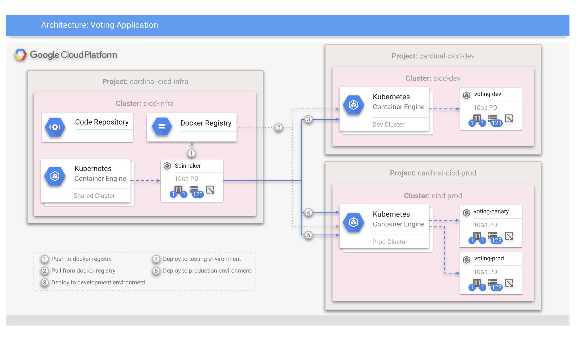

## Prerequisites for Spinnaker

* A Google Cloud Platform Account
* A local machine with a bash shell and ssh client
* `git` installed and configured with `user.email` and `user.name`
* You need `wget`. Macs don't come with it so you'll want to `brew install 
wget` if you're on a Mac.

## Deployment

### Initial Setup

1. Create a new Google Cloud Platform project: [https://console.developers.google.com/project](https://console.developers.google.com/project)

2. Open a Terminal on your local machine.

3. When the shell is open, set up your environment variables.

    ```shell
    PROJECT=$(gcloud config get-value project)
    GKE_ZONE=us-west1-b
    GKE_NAME=spinnaker
    SPIN_SA=spinnaker-storage-account
    HALYARD_SA=halyard-service-account
    HALYARD_HOST=halyard-host
    gcloud config set project $PROJECT
    gcloud config set compute/zone $GKE_ZONE
    ```

4. Enable the GCP APIs required for the project. Each line takes a moment. You 
only need to do this **once** for the life of your project.

    ```shell
    # Google Cloud APIs
    gcloud services enable cloudapis.googleapis.com
    # Identity and Access Management (IAM) API
    gcloud services enable iam.googleapis.com
    # Cloud Resource Manager API
    gcloud services enable cloudresourcemanager.googleapis.com
    # Compute Engine API
    gcloud services enable compute.googleapis.com
    # Kubernetes Engine API
    gcloud services enable container.googleapis.com
    # Container Registry API
    gcloud services enable containerregistry.googleapis.com
    # Cloud Container Builder API
    gcloud services enable cloudbuild.googleapis.com
    # Stackdriver Logging API
    gcloud services enable logging.googleapis.com
    # Stackdriver Monitoring API
    gcloud services enable monitoring.googleapis.com
    # Google Cloud Storage JSON API
    gcloud services enable storage-api.googleapis.com
    # Google Cloud Storage
    gcloud services enable storage-component.googleapis.com
    # Cloud Source Repositories API
    gcloud services enable sourcerepo.googleapis.com
    ```

### Create a Kubernetes Cluster

1. You'll use Google Container Engine to create and manage your Kubernetes 
cluster.

    ```shell
    gcloud container clusters create $GKE_NAME \
       --machine-type=n1-standard-4
    ```

2. Once that operation completes, download the credentials so we can use 
Kubernetes' CLI tool `kubectl`.

    ```shell
    gcloud container clusters get-credentials $GKE_NAME
    ```

3. Confirm that the cluster is running and `kubectl` is working by listing pods:

    ```shell
    $ kubectl get pods
    ```
    You should see the message "no resources found."

### Create a Service Account for Kubernetes

1. Create the base account.

    ```shell
    kubectl create serviceaccount spinnaker-service-account
    ```

2. Assign the cluster-admin IAM role to the spinnaker-service-account

    ```shell
    kubectl create clusterrolebinding \
     --user system:serviceaccount:default:spinnaker-service-account \
        spinnaker-role \
     --clusterrole cluster-admin
    ```

### Create a [Namespace](https://kubernetes.io/docs/concepts/overview/working-with-objects/namespaces/)

Create a namespace for the Spinnaker resources that will be created in this
project.

```shell
kubectl create namespace spinnaker
```

### Get the Token for the Service Account and Store it locally

```shell
SERVICE_ACCOUNT_TOKEN=$(kubectl get serviceaccounts spinnaker-service-account \
  -o jsonpath='{.secrets[0].name}')
```

Create a local token file that will be copied-to the Halyard VM and used by 
Halyard to provision the Spinnaker cluster.

```shell
kubectl get secret $SERVICE_ACCOUNT_TOKEN -o jsonpath='{.data.token}' | \
    base64 --d > ${GKE_NAME}_token.txt
```

### Halyard Setup

1. Create a service account for Halyard

    ```shell
    gcloud iam service-accounts create $HALYARD_SA \
      --display-name $HALYARD_SA
    ```

2. Setup the email account for the policy bindings

    ```shell
    HALYARD_SA_EMAIL=$(gcloud iam service-accounts list \
      --filter="displayName:$HALYARD_SA" \
      --format='value(email)')
    ```

3. Give the account access to download GCS and GCR credentials

    ```shell
    gcloud projects add-iam-policy-binding $PROJECT \
       --role roles/iam.serviceAccountKeyAdmin \
       --member serviceAccount:$HALYARD_SA_EMAIL
    ```

4. Give the account access to download Kubernetes credentials

    ```shell
    gcloud projects add-iam-policy-binding $PROJECT \
       --role roles/container.developer \
       --member serviceAccount:$HALYARD_SA_EMAIL
    ```

5. Create a service account for Spinnaker

    ```shell
    gcloud iam service-accounts create $SPIN_SA \
       --display-name $SPIN_SA
    ```

6. Setup the email account for the policy bindings

    ```shell
    SPIN_SA_EMAIL=$(gcloud iam service-accounts list \
       --filter="displayName:$SPIN_SA" \
       --format='value(email)')
    ```

7. Give the account the ability to manage storage

    ```shell
    gcloud projects add-iam-policy-binding $PROJECT \
       --role roles/storage.admin \
       --member serviceAccount:$SPIN_SA_EMAIL
    ```

8. Give the account access to the higherarchy of the project

    ```shell
    gcloud projects add-iam-policy-binding $PROJECT \
       --member serviceAccount:$SPIN_SA_EMAIL \
       --role roles/browser
    ```

### Create the Halyard VM

```shell
gcloud compute instances create $HALYARD_HOST \
    --scopes=cloud-platform \
    --service-account=$HALYARD_SA_EMAIL \
    --image-project=ubuntu-os-cloud \
    --image-family=ubuntu-1404-lts \
    --machine-type=n1-standard-4
```

Copy the token file over to the VM, and then delete the file locally.

```shell
gcloud compute scp ./${GKE_NAME}_token.txt $HALYARD_HOST:~/

rm ./${GKE_NAME}_token.txt
```

### SSH to the Halyard VM from your local machine

#### You must run this command from your local machine, not the Cloud Shell.

The rest of the work will be done on the VM that will contain the Halyard 
installation. Halyard will allow us to deploy a spinnaker cluster. SSH tunnels 
will be set up so you can access Spinnaker's UI from your local machine. 

```shell
gcloud compute ssh $HALYARD_HOST
```

### Set-up the environment on the Halyard VM

If you need to re-login to the Halyard VM, you'll need to set up these 
variables again for the new session.

```shell
PROJECT=$(gcloud config get-value project)
GKE_NAME=spinnaker
GKE_ZONE=us-west1-b
SPIN_SA=spinnaker-storage-account
SPIN_SA_DEST=~/.gcp/gcp.json
gcloud config set project $PROJECT
gcloud config set compute/zone $GKE_ZONE
```

### Install `kubectl`

```shell
KUBECTL_LATEST=$(curl -s \
    https://storage.googleapis.com/kubernetes-release/release/stable.txt)

curl -LO https://storage.googleapis.com/kubernetes-release/release/\
$KUBECTL_LATEST/bin/linux/amd64/kubectl

chmod +x kubectl

sudo mv kubectl /usr/local/bin/kubectl
```

### Install Halyard

```shell
curl -O https://raw.githubusercontent.com/spinnaker/halyard/master/install/\
debian/InstallHalyard.sh

sudo bash InstallHalyard.sh

. ~/.bashrc
```

### Set-up the service account for configuring Spinnaker

```shell
mkdir -p $(dirname $SPIN_SA_DEST)

SPIN_SA_EMAIL=$(gcloud iam service-accounts list \
    --filter="displayName:$SPIN_SA" \
    --format='value(email)')
    
gcloud iam service-accounts keys create $SPIN_SA_DEST \
    --iam-account $SPIN_SA_EMAIL
```

### Set the Spinnaker version to latest

```shell
hal config version edit --version $(hal version latest -q)
```

### Configure Halyard to use [GCS](https://cloud.google.com/storage/) for storage

```shell
hal config storage gcs edit \
    --project $(gcloud info --format='value(config.project)') \
    --json-path ~/.gcp/gcp.json

hal config storage edit --type gcs
```

### Configure Halyard to use the [GCR](https://cloud.google.com/container-registry/)

```shell
hal config provider docker-registry enable

hal config provider docker-registry account add my-gcr-account \
    --address gcr.io \
    --password-file ~/.gcp/gcp.json \
    --username _json_key \
    --repositories $PROJECT/sample-app
```

### Get the credentials from `gcloud` so we can use `kubectl`

```shell
gcloud container clusters get-credentials $GKE_NAME
```

### Set `kubectl` up with our credentials

```shell
kubectl config set-credentials $(kubectl config current-context) \
    --token $(cat ${GKE_NAME}_token.txt)
```

### Add the GCR account to the Kubernetes provider

```shell
hal config provider kubernetes account add $GKE_NAME \
    --docker-registries my-gcr-account \
    --context $(kubectl config current-context)
```

### Set Kubernetes as the provider for Halyard

```shell
hal config provider kubernetes enable

hal config deploy edit \
    --account-name $GKE_NAME \
    --type distributed
```

### Use Halyard to deploy Spinnaker

It takes some time for Halyard to deploy Spinnaker into your Kubernetes cluster.

```shell
hal deploy apply
```

Once the `apply` is complete, you can log out of the Halyard VM.

### Connect the Spinnaker UI to your local machine

You need to do this part in two local Terminals (not the Cloud Shell). Leave 
each command running. You can ctrl-C out of them whenever you don't want access 
to the Spinnaker UI any more.

In Terminal #1:

```shell
DECK_POD=$(kubectl get pod -n spinnaker \
    -l load-balancer-spin-deck=true \
    -o jsonpath='{.items[0].metadata.name}')
    
kubectl port-forward $DECK_POD 9000:9000 -n spinnaker
```

In Terminal #2:

```shell
GATE_POD=$(kubectl get pod -n spinnaker \
    -l load-balancer-spin-gate=true \
    -o jsonpath='{.items[0].metadata.name}')

kubectl port-forward $GATE_POD 8084:8084 -n spinnaker
```

Now, you can connect to `http://localhost:9000` to access the Spinnakker UI 
running within Kubernetes.

### Create sample-app source code repository

#### In a local Terminal window:

1. Download the source code to your local machine

    ```shell
    wget https://gke-spinnaker.storage.googleapis.com/sample-app.tgz \
        --no-check-certificate
    ```

2. Unpack the source code

    ```shell
    tar xzfv sample-app.tgz
    ```

3. Change directories to the top of the sample-app dir

    ```shell
    cd sample-app
    ```

4. Make the initial commit to your source code repository

    ```shell
    git init
    git add .
    git commit -m "Initial commit"
    ```

5. Create a source repository for your sample-app code

    ```shell
    gcloud source repos create sample-app
    git config credential.helper gcloud.sh  
    ```

6. Set the remote for your repository

    ```shell
    PROJECT=[YOUR PROJECT ID HERE]
    git remote add origin \
       https://source.developers.google.com/p/$PROJECT/r/sample-app
    ```

7. Push your code to the newly-created source code repository

    ```shell
    git push origin master
    ```

### Create a build trigger

1. In the GCP Console, click **Build Triggers** in the Container Registry 
section
2. In the GCP Console navigate to `Container Registry > Build Triggers`
3. Click **Create Trigger**
4. Select **Cloud Source Repository** and click **Continue**
5. Select the `sample-app` repository from the list and click **Continue**
6. Set the following trigger settings:
    * **Name:** sample-app-tags
    * **Trigger type:** Tag
    * **Tag (regex):** v.&ast;
    * **Build configuration:** cloudbuild.yaml
    * **cloudbuild.yaml location:** `/ cloudbuild.yaml`
7. Click **Create Trigger**

#### Here's the dialog filled-out:

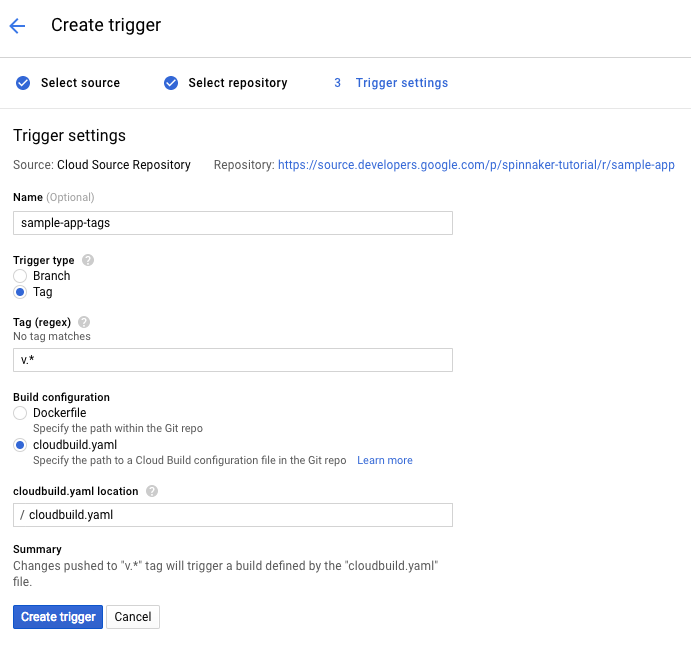

From now on, whenever you push a Git tag prefixed with the letter "v" to your 
source code repository, Container Builder automatically builds and pushes your 
application as a Docker image to Container Registry.

### Build your Docker image

The trigger we previously created will see new tags (that start with "v") and 
will build a Docker image and store it in your Container Registry.

1. Create a git tag

    ```shell
    git tag v1.0.0
    ```

2. Push the tag to set-off the trigger

    ```shell
    git push --tags
    ```

3. In the Cloud Console, go to `Container Registry > Build History` to check 
that the build has been triggered. If not, verify the trigger was configured 
properly in the previous section.

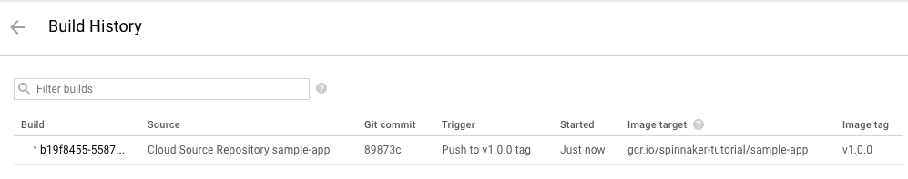

### Create a deployment pipeline within Spinnaker

Using the Spinnaker application, we're going to create an application, create 
the load balancers, and a pipeline.

#### Create the application

1. In the Spinnaker UI at (`http://localhost:9000`), click **Actions**, then 
click **Create Application**
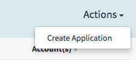

2. In the New Application dialog, enter the following fields:
    * **Name:** sample
    * **Owner Email:** [your email address]
3. Click **Create**
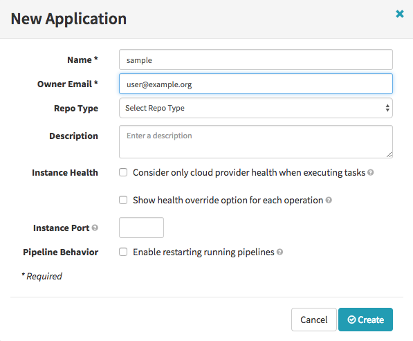

#### Create service load balancers

We use Kubernetes deployment files to set up the load balancers. They are 
`.yaml` files under the `k8s/services` directory. Run the following commands
to create the services for sample-app. These resources are going to get created
in the spinnaker Kubernetes Engine cluster.

```shell
kubectl apply -f k8s/services
```

#### Create the deployment pipeline

Next, you create the continuous delivery pipeline. In this tutorial, the 
pipeline is configured to detect when a Docker image with a tag prefixed with 
"v" has arrived in your Container Registry.

1. Run the following command to generate a properties file which defines the 
pipeline we want to deploy:

    ```shell
    sed s/PROJECT/$PROJECT/g spinnaker/pipeline-deploy.json | \
        sed 's/"local"/"spinnaker"/g' | \
        sed 's/"gcr"/"my-gcr-account"/g' > pipeline.json
    ```

2. In the Spinnaker UI at (`http://localhost:9000`) click on the application 
you created earlier (called sample).
3. Click on **Pipelines**
4. Click on **Configure a new Pipeline**
5. In the resulting dialog, enter:
    1. **Select Type**: Pipeline
    2. **Pipeline Name**: sample
6. Click on create.
7. Click on `Pipeline Actions > Edit as JSON`
    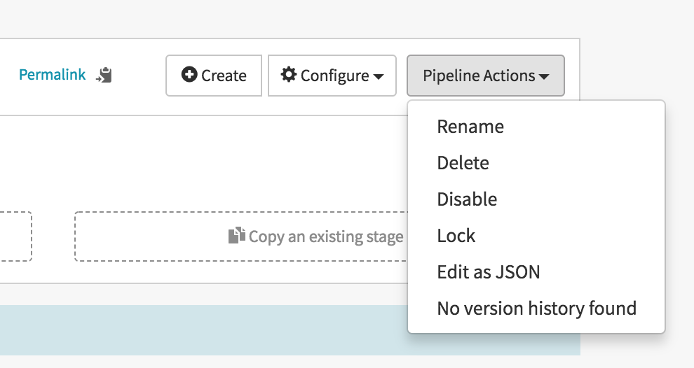
8. Replace the JSON you see with the contents of the pipeline.json file we made 
in **Step 1** above.
9. Click on **Update Pipeline**
10. Click on **Save Changes**. You should see a pipleline like this:
    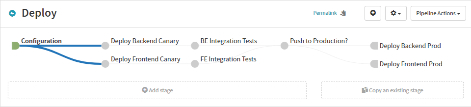

#### Run your pipeline manually

The configuration you just created contains a trigger to start the pipeline 
when you push a new Git tag containing the prefix "v". In this section of the 
tutorial, you test the pipeline by running it manually.

1. Click **Start Manual Execution**

    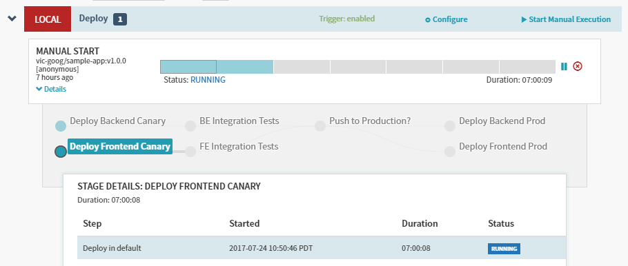

2. Select the v1.0.0 tag from the **Tag** drop-down list, then click **Run**

    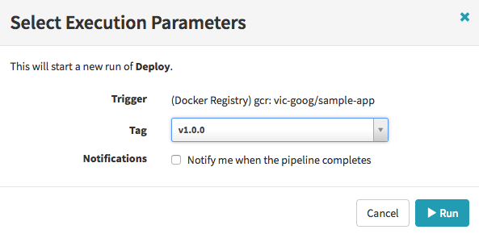

3. After the pipeline starts, click **Details** to see more information about 
the build's progress. This section shows the status of the deployment pipeline 
and its steps. Steps in blue are currently running, green ones have completed 
successfully, and red ones have failed. Click a stage to see details about it.

It takes a while for the test phases to complete. Once they're done, it will 
pause before a push to production. It requires human intervention to push into 
production so:

4. Hover over the yellow "person" icon and click **Continue**.

    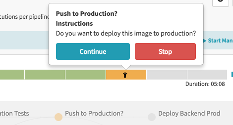

5. After you press Continue, it will take a few minutes and then the pipeline 
will complete.

## Validation

1. Hover over the **Infrastructure** item at the top of the screen and select 
**Load Balancers** from the drop-down.

    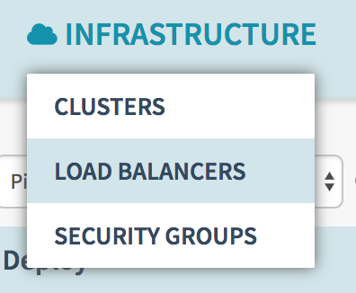
    
2. Click on the word **DEFAULT** in the sample-frontend-prod and look to the 
right afterward.

    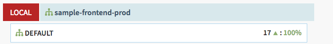

3. On the panel that appears to the right, there's a mention of **Ingress**. 
Click on that IP and it will bring you to the page.

    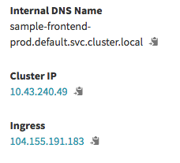

4. You will see the result page (like the following image) that hit the backend 
to produce JSON and then the frontend rendered into HTML.

    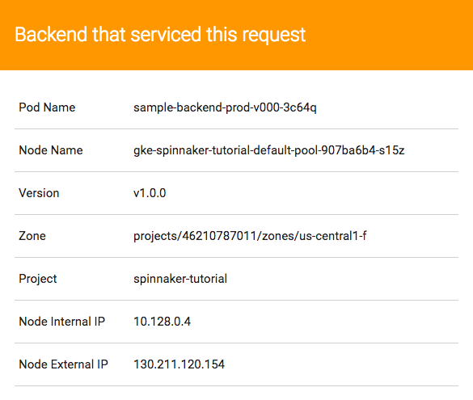

## Tear Down

### Approach #1

This will remove the resources that the Halyard VM process created.  It's not a 
full Tear Down.

```shell
hal deploy clean
rm -rf ~/.hal/*
rm -rf ~/.gcp
```

### Approach #2

If you want to make sure you zero-out anything that could bill you, go to the 
following menu item in the Cloud Console:

`IAM & admin > Manage resources`

Select your project and press the **delete** button.

## Troubleshooting

1. `hal deploy apply` will mark exceptions in red. Other `hal` commands will 
too.
2. Halyard configurations can be overwritten by following the Tear Down 
instructions and re-running the Halyard instructions again.
3. Make sure your `gcloud config set project $PROJECT` and `gcloud config set 
compute/zone $GKE_ZONE` commands are always set up before any command-line 
sessions you begin. If you're wondering what your current config looks like, 
use `gcloud config list`.
4. If you're having trouble running kubectl, make sure you've run `gcloud 
container clusters get-credentials spinnaker` after correctly setting your 
project.
5. If you go to the Spinnaker UI and it just shows the logo and spins 
endlessly, make sure you have the SSH tunnel to 8084 running.

## Relevant Material

### Using HALYARD :

* [Halyard on Kubernetes Engine](https://www.spinnaker.io/setup/quickstart/halyard-gke/)
