# Spinnaker Pipeline Templates

## Table of Contents

* [Spinnaker Pipeline Templates](#spinnaker-pipeline-templates)
  * [Introduction](#introduction)
  * [Prerequisite](#prerequisite)
  * [Simple Workflow - Creating a configuration from existing pipelines](#simple-workflow---creating-a-configuration-from-existing-pipelines)
  * [Connect to the halyard host](#connect-to-the-halyard-host)
  * [Roer command line tool](#roer-command-line-tool)
  * [Export pipeline template](#export-pipeline-template)
  * [Configuration with variable](#configuration-with-variable)
  * [Troubleshooting](#troubleshooting)
  * [Templating Specifications](#templating-specifications)

## Introduction

Spinnaker provides pipeline configuration as YAML templates to enable users the
ability to setup "infrastructure as code" in an organization. The following
guide will help DevOps engineers get started on templatized pipeline
configurations.

**Note: Pipeline Templating is an Alpha feature; please see the github page
below for an up-to-date information on the Spinnaker feature. Spinnaker is
working on a new templating strategy and is planned to be release later this
year.**

Public collection of Spinnaker declarative pipeline templates:

```
https://github.com/spinnaker/pipeline-templates
```

Pipeline Templates:

```
https://github.com/spinnaker/dcd-spec/blob/master/PIPELINE_TEMPLATES.md
```

Alpha Getting Started:

```
https://github.com/spinnaker/dcd-spec/blob/master/ALPHA-GETTING-STARTED.md
```

## Prerequisite

Please setup a base Spinnaker deployment using the installation scripts under
[Spinnaker Setup Scripts](../scripts/DEVELOPER_README.md)

The installation script will download and setup a specific version of roer. The
version is configured using the properties file described in
[Spinnaker Setup Scripts](../scripts/DEVELOPER_README.md)

```
...
# Default ROER version to install
# Roer is used for Spinnaker pipeline templates POC; please see main README.md
ROER_VERSION=v0.11.3

# Default tool to download; only change if the halyard host will change
ROER_NAME=roer-linux-amd64
...
```

If the Spinnaker environment was setup using the main [README.md](../README.md),
please make sure that pipeline templates is enabled through hal.

```
hal config features edit --pipeline-templates true
```

If changes to hal config is implemented, the deployed services need to be
restarted.

```
hal deploy apply --service-names=deck,orca
```

Also, please install Roer manually, if following the manual Spinnaker
installation.

```
ROER_PACKAGE_BASE="https://github.com/spinnaker/roer/releases/download"
ROER_PACKAGE="$ROER_PACKAGE_BASE/$ROER_VERSION/$ROER_NAME"

# Download roer
$ wget "$ROER_PACKAGE"

# Make roer executable
$ chmod +x "$ROER_NAME"
```

## Simple Workflow - Creating a configuration from existing pipelines

Create a new application to represent a sample project. This application will
hold all the resources created in the POC. The application creation and pipeline
creation using the user interface is only done to get an initial template
resource.

Since the feature is highly dynamic and is in an alpha state, creating an
initial configuration using the ui and doing an export would ensure that the
template follows a schema that can be accepted by the system.

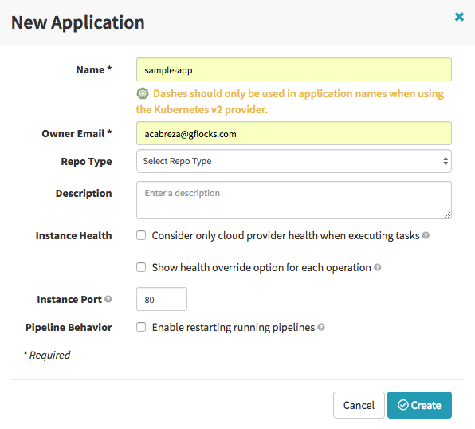

Create a new pipeline using the Spinnaker user interface. This pipeline will
serve as the base pipeline for the template.

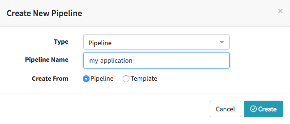

For the purpose of demonstrating the simple workflow, an empty pipeline will
suffice.

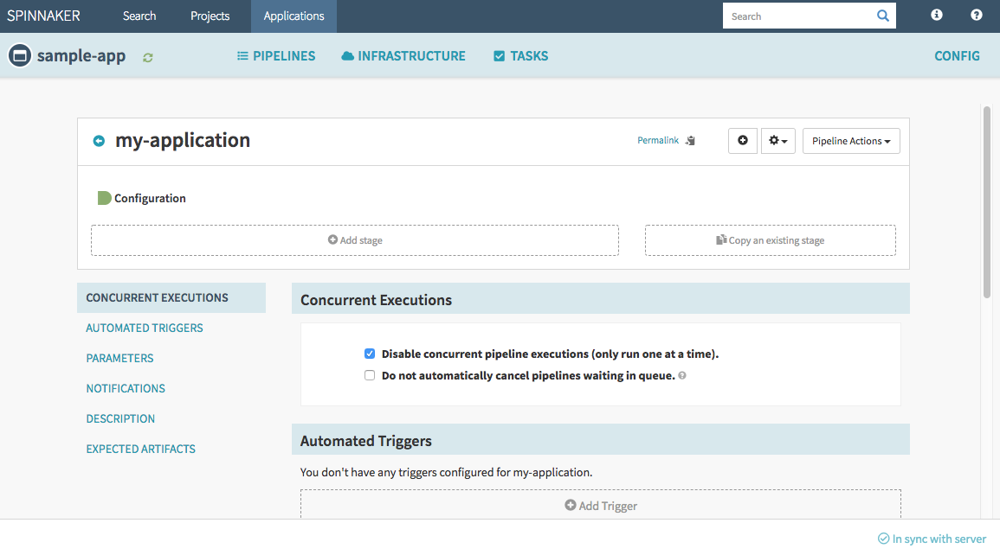

## Connect to the halyard host

The Spinnaker installation configured by the
[Spinnaker Setup Scripts](../scripts/DEVELOPER_README.md) creates a halyard host
GCE compute instance where the next few commands will be performed.

Please go to the Google Cloud Console:
```
https://console.cloud.google.com/compute/instances?project=[PROJECT]
```

Search for the halyard-host-[id], and connect to the host by selecting the "SSH"
button.

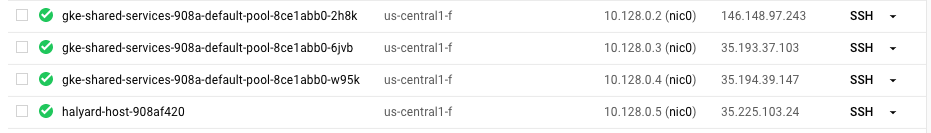

Alternatively, a terminal session to the halyard host compute instance can be
started using the gcloud command.

Find the following values from your spinnaker_gke_halyard.properties file
configured from [Spinnaker Setup Scripts](../scripts/DEVELOPER_README.md)

```
...
PROJECT=arnold-test-123
GKE_ZONE=us-central1-f
CLUSTER_USER=acabreza
...
```

Obtain the halyard-host name from gcloud tool.

```
gcloud compute instances list | grep halyard-host
halyard-host-[id] us-central1-f n1-standard-4 10.128.0.5 35.226.196.180 RUNNING
```

Connect to halyard host.

```
gcloud compute ssh [CLUSTER_USER]@$halyard-host-[id] --project=[PROJECT] \
--zone=[GKE_ZONE]
```

## Roer command line tool

Roer is a thin Spinnaker command line tool that is used to manage entities
inside the Spinnaker application. It can manage applications, pipelines, and
templates. It is installed in the halyard host described above.

Before the command line tool roer can be used, it needs to know where the
Spinnaker API service port is located.

Set the environment variable SPINNAKER_API
```
halyard-host$ export SPINNAKER_API=http://localhost:8084
```

## Export pipeline template

The pipeline created in the previous steps can be exported and used as a
baseline pipeline template.

```
halyard-host$ ./roer-linux-amd64 pipeline-template convert sample-app \
my-application
```

Only copy the highlighted text to a new file, template.yml.

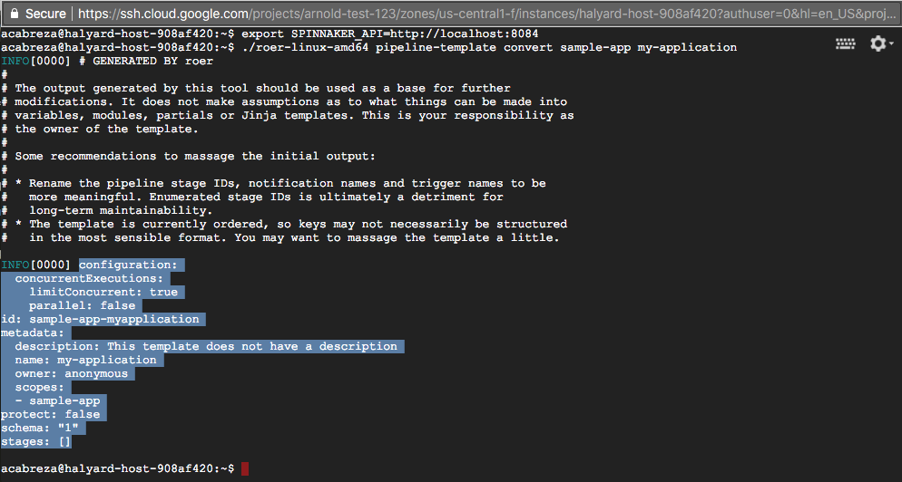

```
halyard-host$ cat template.yml
configuration:
  concurrentExecutions:
    limitConcurrent: true
    parallel: false
id: sample-app-myapplication
metadata:
  description: This template does not have a description
  name: my-application
  owner: anonymous
  scopes:
  - sample-app
protect: false
schema: "1"
stages: []
```

Publish the template to Spinnaker.

```
halyard-host$ ./roer-linux-amd64 pipeline-template publish template.yml
```

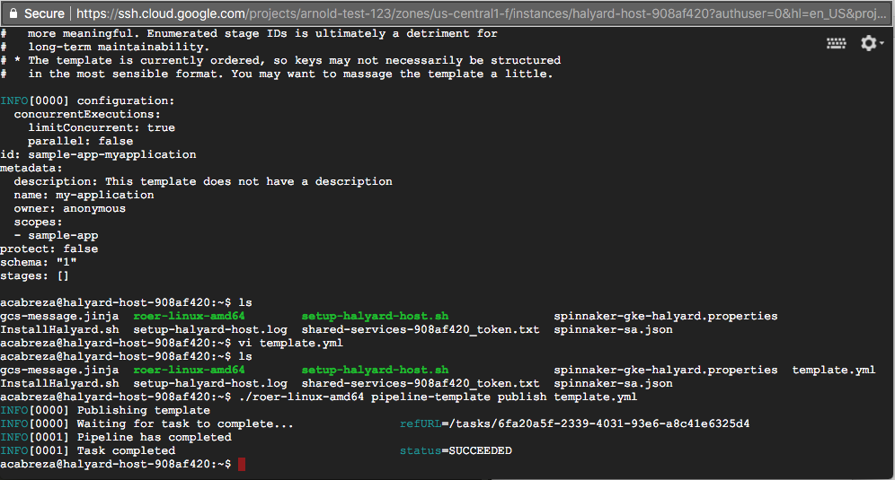

Create a new pipeline based on the template.yml

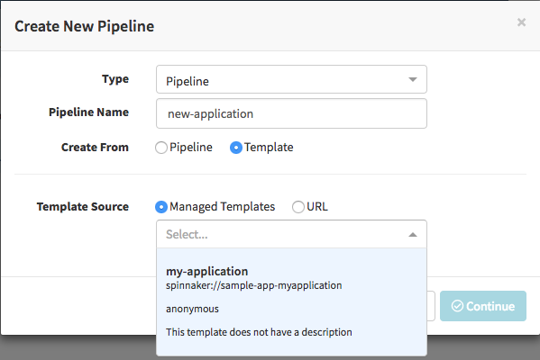

The new pipeline "new-application" is created.

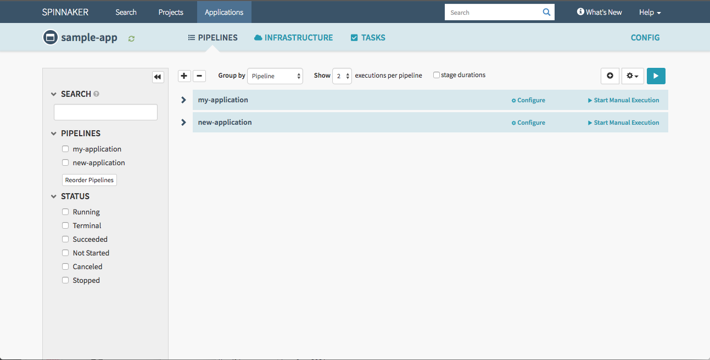

## Configuration with variable

The following section shows a use case on using a list variable. It illustrates
use of a list variable to define different region configuration for GCP.

Each region is generated by a reference to a "module" section. The module
definition will fill in the information needed under "clusters" section. The
region values will be filled-in as template parameters on the Spinnaker ui.

Create a new template file.

```
cat <<EOT >> multi-region-template.yml
configuration:
  concurrentExecutions:
    limitConcurrent: true
    parallel: false
id: sample-app-myapplication
metadata:
  description: This template does not have a description
  name: my-application
  owner: anonymous
  scopes:
  - sample-app
protect: false
schema: "1"
variables:
- name: regions
  description: A list of regions to deploy into.
  type: list
  defaultValue:
  - us-east1-a
  - us-west1-b
stages:
- id: bake
  type: bake
  config:
    package: foo
    notifications: []
    comments: ""
- id: deploy
  type: deploy
  config:
    clusters: |
      
      - 
      
modules:
- id: deploy-cluster-gcp
  usage: Defines a deploy stage cluster using GCP provider
  variables:
  - name: region
    description: The GCP region to deploy into
  definition:
    provider: gcp
    account: local
    region: "{{region}}"
EOT
```

Upload the template using roer tool.

```
halyard-host$ ./roer-linux-amd64 pipeline-template publish \
multi-region-template.yml
```

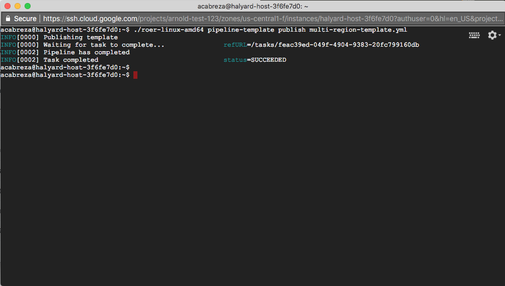

After upload completes, create a new pipeline from the new uploaded template.
The "Define template parameters" dialog box will appear for the configured
variables. For more information on supported variables, please check the
Spinnaker templating specifications.

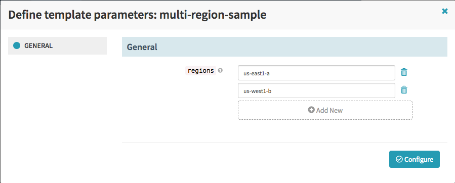

The deploy configuration for each region is created.

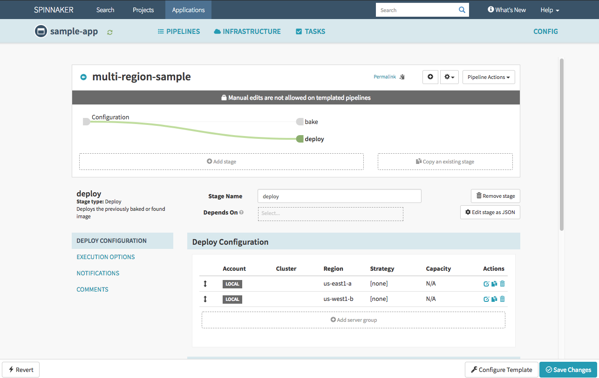

## Troubleshooting

1. If templates fail to publish, please make sure prerequisite is satisfied.
If template is malformed, please make sure yml file is well formed and all tags
are supported, please see "Template Specifications" below.

```
halyard-host$ ./roer-linux-amd64 pipeline-template publish template.yml
INFO[0000] Publishing template
INFO[0000] Waiting for task to complete... \
  refURL=/tasks/c92f6954-fed0-48bf-9d07-3f3947a370f4
INFO[0001] Pipeline has completed
ERRO[0001] Task failed status=TERMINAL
WARN[0001] failed prettyifying response error="unexpected end of JSON input"
ERRO[0001]
```

## Templating Specifications

The following describes all the templating features available. Please note that
most features are in active development and is highly dynamic.

```https://github.com/spinnaker/dcd-spec/blob/master/PIPELINE_TEMPLATES.md```
