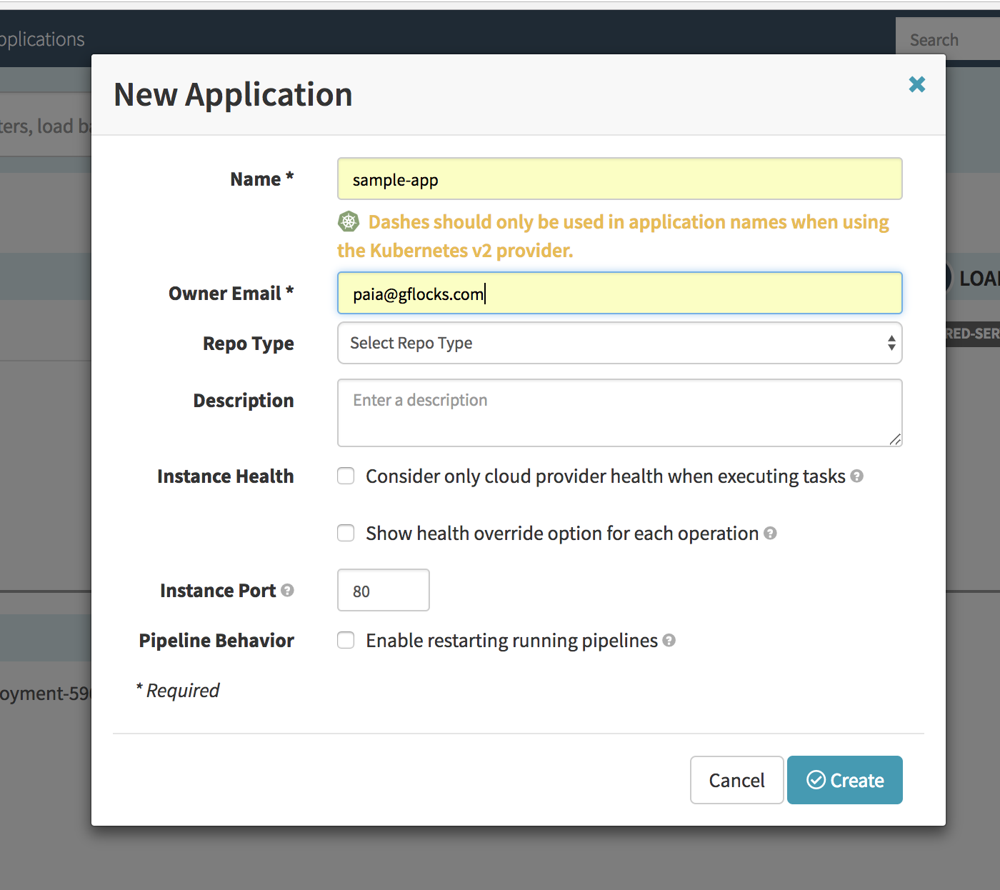

##  Deploying Manifests in Artifacts using Spinnaker

* [Deploying Manifests in Artifacts using Spinnaker](#deploying-manifests-in-artifacts-using-spinnaker)
    * [Manifests](#manifests)
    * [Cloud Pub/Sub](#cloud-pubsub)
    * [Artifact](#artifact)
    * [Configure Kubernetes Provider V2(Manifest Based):](#configure-kubernetes-provider-v2manifest-based)
* [Setup Artifact account](#setup-artifact-account)
    * [Spinnaker Configuration](#spinnaker-configuration)
    * [Once logged in execute hal deploy connect](#once-logged-in-execute-hal-deploy-connect)
      * [Spinnaker UI](#spinnaker-ui)
      * [Application Creation in Spinnaker](#application-creation-in-spinnaker)
      * [Pipeline creation](#pipeline-creation)
      * [GCS Artifact configuration](#gcs-artifact-configuration)
      * [Automated Trigger Setup](#automated-trigger-setup)
      * [Add a Deploy stage](#add-a-deploy-stage)
      * [Uploading of yml file in GCS Storage Bucket](#uploading-of-yml-file-in-gcs-storage-bucket-)
    * [Test the pipeline](#test-the-pipeline)
      * [Validation Steps :](#validation-steps-)
      * [Tear down Steps:](#tear-down-steps)
      * [Reference urls :](#reference-urls-)


The [Spinnaker Kubernetes Provider V2](https://www.spinnaker.io/reference/providers/kubernetes-v2/) brings the declarative infrastructure management
paradigm to Spinnaker.

In V2, the manifests that are used to deploy applications can be treated like
any other artifact.

In this example we will walk through using a manifest stored in a GCS bucket.
When it changes, a Cloud Pub/Sub event will be triggered and cause Spinnaker
to deploy the updated manifest.

### Manifests

A manifest is a yaml, read-only, fully expanded list of all kubernetes resources
needed for a deployment.  

There are two ways to deploy a manifest:

1. The manifest is supplied statically to a pipeline as text.
2. The manifest is supplied as an artifact.

In this example we will use the second type and supply a manifest as an
artifact.

### Cloud Pub/Sub

Cloud Pub/Sub brings the scalability, flexibility, and reliability of
enterprise message-oriented middleware to the cloud.

A publisher application creates and sends messages to a Pub/Sub topic.  A
subscriber application creates a subscription to a Pub/Sub topic to receive
messages from it.  This enables the publisher and subscriber applications to
operate asynchronously.

### Artifact
In Spinnaker, an artifact is an object that references an external resource.
That resource could be

* a Docker image
* a file stored in GitHub
* an Amazon Machine Image (AMI)
* a binary blob in S3, GCS, etc

### Configure Kubernetes Provider V2(Manifest Based):

Enable the v2 provider for Spinnaker

```
hal config provider kubernetes enable   
CLUSTER_NAME=shared-services
GCR_ACCOUNT=gcr-$CLUSTER_NAME
hal config provider kubernetes account add $CLUSTER_NAME \
    --docker-registries $GCR_ACCOUNT \
    --context $(kubectl config current-context) \
    --provider-version v2  
hal config features edit --artifacts true
```

## Setup Artifact account

Create a Google Cloud account in your project with access to a GCS bucket.

Configure halyard with this account.

Spinnaker needs a service account to authenticate as against GCP, with the
roles/storage.admin role enabled. If you don’t already have such a service
account with the corresponding JSON key downloaded, hence we have
spinnaker-sa.json file stated below.

Reference url:
[Spinnaker artifacts for GCS](https://www.spinnaker.io/setup/artifacts/gcs/)

```
SPIN_SA_KEY=spinnaker-sa.json
SPINNAKER_SA=$SPIN_SA_KEY
ARTIFACT_ACCOUNT_NAME=gcsaa-$CLUSTER_NAME
hal config features edit --artifacts true
hal config artifact gcs account add $ARTIFACT_ACCOUNT_NAME \
  --json-path $SPINNAKER_SA
hal config artifact gcs enable
```

Create the GCS bucket.

```
BUCKET=GCS bucket name.
gcloud auth activate-service-account --key-file=$SPINNAKER_SA
gsutil mb -p $PROJECT gs://${BUCKET}
```

Configure a Spinnaker Storage object with the GCS bucket.

```
hal config storage gcs edit \
  --project $(gcloud info --format='value(config.project)') \
  --json-path $SPINNAKER_SA
hal config storage edit --type gcs
```

Create GCS Pub/Sub Topic for receiving messages from the (GCS) bucket.

```   
MESSAGE_FORMAT=GCS

# Given that you’ll be listening to changes in a GCS bucket ($BUCKET), the
# following command will create (or use an existing) topic with name $TOPIC
# (any name is allowed) to publish messages.

gsutil notification create -t $TOPIC -f json gs://${BUCKET}

# Finally, create a pull subscription named $SUBSCRIPTION to listen for changes
# to this topic:

gcloud beta pubsub subscriptions create $SUBSCRIPTION --topic $TOPIC

# The topic name and subscription names are present in the scripts
```

Now that the Pub/Sub infrastructure is created, configure Spinnaker to listen
for messages.

```   
# You can pick this name, it's meant to be human-readable
PUBSUB_NAME=pubsub-$CLUSTER_NAME

# First, make sure that Google Pub/Sub support is enabled:
hal config pubsub google enable

# Next, add your subscription

CLUSTER_NAME=shared-services
TOPIC=topic-$CLUSTER_NAME
SUBSCRIPTION=subs-$CLUSTER_NAME
PROJECT=gflocks project
GCS_TEMPLATE=gcs-jinja.json
PUBSUB_NAME=pubsub-$CLUSTER_NAME
MESSAGE_FORMAT=GCS

hal config pubsub google subscription add $PUBSUB_NAME \
  --subscription-name $SUBSCRIPTION \
  --json-path $SPINNAKER_SA \
  --project $PROJECT \
  --template-path $GCS_TEMPLATE \
  --message-format $MESSAGE_FORMAT
```

### Spinnaker Configuration
The following steps require using the Spinnaker UI.

you would need to execute the portforward.sh scripts :

```
#!/bin/bash -e

USER=XXX (username of gflocks/google account)
HALYARD_HOST=halyard-host-XXXXX (Halyard-host-id created during script execution)
PROJECT=project-id (gflocks/google account)
ZONE=us-central1-f

gcloud compute ssh $USER@$HALYARD_HOST \
  --project=$PROJECT \
  --zone=$ZONE \
  --ssh-flag="-L 9000:localhost:9000" \
  --ssh-flag="-L 8084:localhost:8084"
```
### Once logged in execute hal deploy connect

#### Spinnaker UI
Once the appropriate ports are forwarded, navigate to the Spinnaker UI at
http://localhost:9000

#### Application Creation in Spinnaker
First, you need to create a Spinnaker Application. On the right, there is an
`Actions` tab, in which there is an option to `Create an application`.

Clicking on that link opens a pop-up shown below.  The required fields are
`Name` and `Owner Email`.  

Leave the rest blank then click `Create`.



#### Pipeline creation
Once the application is created, there is a tab for Pipelines. Click on that
tab to open another pop-up shown below.

 

 We will need either an existing or a new pipeline that we want to be triggered
on changes to GCS artifacts. If you do not have a pipeline, create one by
selecting `Pipeline` as the `Type` and enter a name for `Pipeline Name`.  Leave
the `Create From` radio button on `Pipeline`.  Click `Create`.  You will now
see many more options to configure.

#### GCS Artifact configuration

Now to configure the artifact, change the “Custom” dropdown to “GCS”, and enter
the fully qualifed GCS path in the Object path field. You can, for example, set
the object path to be gs://${BUCKET}/blobserve/deploy.yml to trigger on any
change to an object inside folder in your ${BUCKET}.

 

#### Automated Trigger Setup
Now select the `Automated Triggers` section of the pipeline configuration. We
need to declare that this pipeline expects to have a specific artifact matching
 some criteria available before the pipeline starts executing.

In doing so, you guarantee that an artifact matching your description is
present in the pipeline’s execution context; if no artifact for this
description is present, the pipeline won’t start.

To configure the trigger:

* `Type` is `Pub/Sub`
* `Pub/Sub System Type` is `Google`
* `Subscription Name` depends on what you’ve configured in your Pub/Sub
   configuration using Halyard.
* `Attribute Constraints` must have `Key`: `eventType`, `Value`: `OBJECT_FINALIZE`
* Finally, `Expected Artifacts` should have available the previously defined
  artifact.

 

#### Add a Deploy stage
We now have a Trigger and an Artifact configured for the Pipeline.  Now we need
to define an action to take, a deployment stage.  Create a new `Stage` by
clicking the `+ Add stage` box and select the `Deploy Manifest` option. Then
fill in the details for your `Account`, `Application`, and `Cluster` as shown
below.

 

Under `Manifest Configuration`, select the previously configured `Expected
Artifact` and `Artifact Account`
The image below shows a deploy stage that deploys a manifest stored in a GCS
bucket.

Since this GCS bucket can contain many objects, we have assigned it an
expected artifact to ensure only changes in that particular object can trigger
this pipeline.

 

#### Uploading of yml file in GCS Storage Bucket :


### Test the pipeline
Now we are ready to test.  If you upload a file to a path matching your
configured Object path, the pipeline should execute.

 

If the pipeline doesn’t execute, check the logs in the Echo service.

Echo service can be found in Workloads with the name spin-echo in kubernetes
cluster.


#### Validation Steps :

Check the creation of Nginx Pod in Kubernetes workloads


The nginx app should appear in the browser


#### Tear down Steps:

Run spinnaker-gke-halyard-clean.sh in your halyard-host terminal to clean up
Spinnaker workloads as well as the all configurations setup earlier by
spinnaker-gke-halyard-deploy.sh scripts.

#### Reference urls :

1) Kindly refer to the Spinnaker scripts for setting up Spinnaker as localhost
with these commands stated above. All of them are compiled as separate
functions and on the execution of the scripts , they get configured in Halyard.

[Link for getting Spinnaker scripts]
(https://partner-code-review.googlesource.com/q/project:helmsman-cardinal)

2) Configuration of Application, Pipeline (trigger as well as artifacts),
 Deploy manifest :

[Deploy Manifests using GCS
Artifacts](https://www.spinnaker.io/guides/user/kubernetes-v2/deploy-manifest/)
