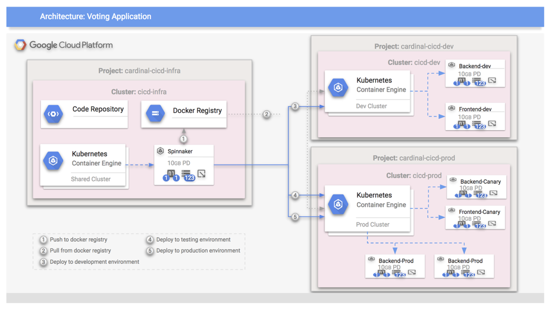

## Setting up Private Clusters for Spinnaker

* [Setting up Private Clusters for Spinnaker](#setting-up-private-clusters-for-spinnaker)
    * [This recipe uses Beta features. Things may very well change.](#this-recipe-uses-beta-features-things-may-very-well-change)
    * [Architecture](#architecture)
    * [Set up your stage environment](#set-up-your-stage-environment)
    * [Create the stage private cluster](#create-the-stage-private-cluster)
    * [Give access to Spinnaker](#give-access-to-spinnaker)
    * [Set up your prod environment](#set-up-your-prod-environment)
    * [Create the prod private cluster](#create-the-prod-private-cluster)
    * [Give access to Spinnaker](#give-access-to-spinnaker-1)
    * [Make Spinnaker aware of the Private Cluster](#make-spinnaker-aware-of-the-private-cluster)
    * [Ssh into your Halyard host](#ssh-into-your-halyard-host)
    * [Do some setup](#do-some-setup)
    * [Get the credentials for the stage Private Cluster](#get-the-credentials-for-the-stage-private-cluster)
    * [Use Halyard to make Spinnaker aware of the stage Private Cluster](#use-halyard-to-make-spinnaker-aware-of-the-stage-private-cluster)
    * [Get the credentials for the prod Private Cluster](#get-the-credentials-for-the-prod-private-cluster)
    * [Use Halyard to make Spinnaker aware of the prod Private Cluster](#use-halyard-to-make-spinnaker-aware-of-the-prod-private-cluster)
    * [Apply the changes to Spinnaker](#apply-the-changes-to-spinnaker)
* [PLACEHOLDER](#placeholder)
    * [Create two more projects (stage and prod)](#create-two-more-projects-stage-and-prod)
    * [Set up stage project](#set-up-stage-project)
    * [Set up prod project](#set-up-prod-project)

#### This recipe uses Beta features. Things may very well change.

This recipe demonstrates how to set-up private Kubernetes clusters within your 
dev and prod environments so Spinnaker can deploy containers outside of the 
public eye. Nodes within a private cluster don't have external IP addresses.

### Architecture

This diagram shows your existing Spinnaker architecture with private clusters 
added to it. The nodes labeled back-end will be deployed into private clusters.



### Set up your stage environment

You can do this in a local Terminal or in Cloud Shell.

```shell
PROJECT=[PUT YOUR SPINNAKER PROJECT ID HERE]
SPINNAKER_GKE_NAME=[NAME OF YOUR SPINNAKER CLUSTER]
STAGE_PROJECT=[PUT YOUR STAGE CLUSTER PROJECT ID HERE]
PVT_STAGE_GKE_NAME=spin-stage-pvt
GKE_ZONE=us-west1-b
```

Let's get `gcloud` configured with the basics. We're also setting `gcloud` to 
use the v1beta API and turning on beta features since Private Clusters are 
currently in beta.

```shell
gcloud config set project $STAGE_PROJECT
gcloud config set compute/zone $GKE_ZONE
gcloud config set container/use_v1_api false
gcloud beta services enable -q
gcloud services enable container.googleapis.com
```

#### Create the stage private cluster

Private Clusters must use a /28 CIDR range. We turn on IP aliases so Kubernetes 
can allocate pod IP addresses. This command takes a while to complete.

```shell
gcloud beta container clusters create $PVT_STAGE_GKE_NAME \
    --private-cluster \
    --master-ipv4-cidr 172.16.0.16/28\
    --enable-ip-alias \
    --create-subnetwork ""
```

#### Give access to Spinnaker

Get the IPs of the nodes of your Spinnaker Installation.  You'll need to enter 
them into the following step.

```shell
gcloud config set project $PROJECT
gcloud container clusters get-credentials $SPINNAKER_GKE_NAME
kubectl get nodes --selector=kubernetes.io/role!=master -o \
  jsonpath='{.items[*].status.addresses[?(@.type=="ExternalIP")].address}' | \
  sed 's/ /\n/g' && echo
gcloud config set project $STAGE_PROJECT
```

Now, give Spinnaker access to the master of your private cluster.

```shell
IP_ADDR_1=[FROM THE STEP ABOVE]
IP_ADDR_2=[FROM THE STEP ABOVE]
IP_ADDR_3=[FROM THE STEP ABOVE]
gcloud container clusters update $PVT_STAGE_GKE_NAME \
    --enable-master-authorized-networks \
    --master-authorized-networks $IP_ADDR_1/32,$IP_ADDR_2/32,$IP_ADDR_3/32
```

### Set up your prod environment

You can do this in a local Terminal or in Cloud Shell.

```shell
PROJECT=[PUT YOUR SPINNAKER PROJECT ID HERE]
SPINNAKER_GKE_NAME=[NAME OF YOUR SPINNAKER CLUSTER]
PROD_PROJECT=[PUT YOUR PROD CLUSTER PROJECT ID HERE]
PVT_PROD_GKE_NAME=spin-prod-pvt
GKE_ZONE=us-west1-b
```

Let's get `gcloud` configured with the basics. We're also setting `gcloud` to 
use the v1beta API and turning on beta features since Private Clusters are 
currently in beta.

```shell
gcloud config set project $PROD_PROJECT
gcloud config set compute/zone $GKE_ZONE
gcloud config set container/use_v1_api false
gcloud beta services enable -q
```

#### Create the prod private cluster

Private Clusters must use a /28 CIDR range. We turn on IP aliases so Kubernetes 
can allocate pod IP addresses. This command takes a while to complete.

```shell
gcloud beta container clusters create $PVT_PROD_GKE_NAME \
    --private-cluster \
    --master-ipv4-cidr 172.16.0.16/28\
    --enable-ip-alias \
    --create-subnetwork ""
```

#### Give access to Spinnaker

Get the IPs of the nodes of your Spinnaker Installation.  You'll need to enter 
them into the following step.

```shell
gcloud config set project $PROJECT
gcloud container clusters get-credentials $SPINNAKER_GKE_NAME
kubectl get nodes --selector=kubernetes.io/role!=master \
    -o jsonpath='{.items[*].status.addresses[?(@.type=="ExternalIP")].address}'
gcloud config set project $PROD_PROJECT
```

Now, give Spinnaker access to your private cluster.

```shell
IP_ADDR_1=[FROM THE STEP ABOVE]
IP_ADDR_2=[FROM THE STEP ABOVE]
IP_ADDR_3=[FROM THE STEP ABOVE]
gcloud container clusters update $PVT_PROD_GKE_NAME \
    --enable-master-authorized-networks \
    --master-authorized-networks $IP_ADDR_1/32,$IP_ADDR_2/32,$IP_ADDR_3/32
```

### Make Spinnaker aware of the Private Cluster

#### Ssh into your Halyard host

```shell
PROJECT=[YOUR PROJECT THAT CONTAINS YOUR HALYARD MACHINE]
HALYARD_HOST=halyard-host
gcloud config set project $PROJECT
gcloud config set compute/zone us-west1-b
gcloud compute ssh $HALYARD_HOST
```

#### Do some setup

```shell
STAGE_PROJECT=[PUT YOUR STAGE CLUSTER PROJECT ID HERE]
PROD_PROJECT=[PUT YOUR PROD CLUSTER PROJECT ID HERE]
```

#### Get the credentials for the stage Private Cluster

```shell
gcloud config set project $STAGE_PROJECT
gcloud config set compute/zone us-west1-b
gcloud container clusters get-credentials spin-stage-pvt
```

#### Use Halyard to make Spinnaker aware of the stage Private Cluster

```shell
hal config provider kubernetes account add backend-pvt-stage \
  --docker-registries my-gcr-account \
  --context $(kubectl config current-context)
```

#### Get the credentials for the prod Private Cluster

```shell
gcloud config set project $PROD_PROJECT
gcloud config set compute/zone us-west1-b
gcloud container clusters get-credentials spin-prod-pvt
```

#### Use Halyard to make Spinnaker aware of the prod Private Cluster

```shell
hal config provider kubernetes account add backend-pvt-prod \
  --docker-registries my-gcr-account \
  --context $(kubectl config current-context)
```

#### Apply the changes to Spinnaker

```shell
hal deploy apply
```

## PLACEHOLDER

### Create two more projects (stage and prod)

**In a new terminal:**

While the previous command runs, now is a good time to make two more projects. 
One project is for staging. The other project is where you will deploy the 
canary/production builds. Both will be simple. They'll each be set up with a 
Kubernetes cluster.

Create the two projects by going to the Cloud Console and, in a local terminal, 
set up some environment variables.

```shell
STAGE_PROJECT=[PUT YOUR STAGE PROJECT ID HERE]
PROD_PROJECT=[PUT YOUR PROD PROJECT ID HERE]
GKE_ZONE=us-west1-b
```

### Set up stage project

1. Get `gcloud` configured to use the current project.

    ```shell
    gcloud config set project $STAGE_PROJECT
    gcloud config set compute/zone $GKE_ZONE
    ```

2. Enable APIs for the project

    ```shell
    gcloud services enable cloudapis.googleapis.com
    gcloud services enable iam.googleapis.com
    gcloud services enable container.googleapis.com
    gcloud services enable containerregistry.googleapis.com
    gcloud services enable storage-api.googleapis.com
    gcloud services enable storage-component.googleapis.com
    ```

3. Create a Kubernetes cluster

    ```shell
    GKE_NAME=spin-stage

	gcloud container clusters create $GKE_NAME \
	   --machine-type=n1-standard-2
    ```

### Set up prod project

1. Get `gcloud` configured to use the current project.

    ```shell
    gcloud config set project $PROD_PROJECT
    gcloud config set compute/zone $GKE_ZONE
    ```

2. Enable APIs for the project

    ```shell
    gcloud services enable cloudapis.googleapis.com
    gcloud services enable iam.googleapis.com
    gcloud services enable container.googleapis.com
    gcloud services enable containerregistry.googleapis.com
    gcloud services enable storage-api.googleapis.com
    gcloud services enable storage-component.googleapis.com
    ```

3. Create a Kubernetes cluster

    ```shell
    GKE_NAME=spin-prod

	gcloud container clusters create $GKE_NAME \
	   --machine-type=n1-standard-2
    ```
