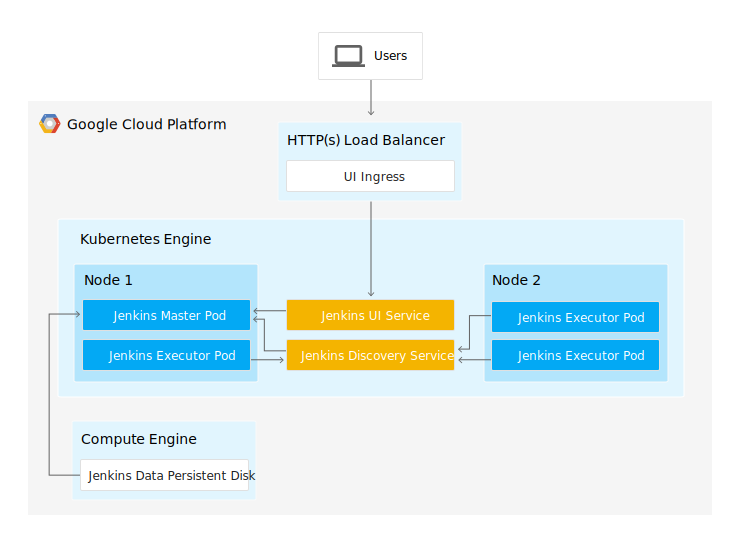
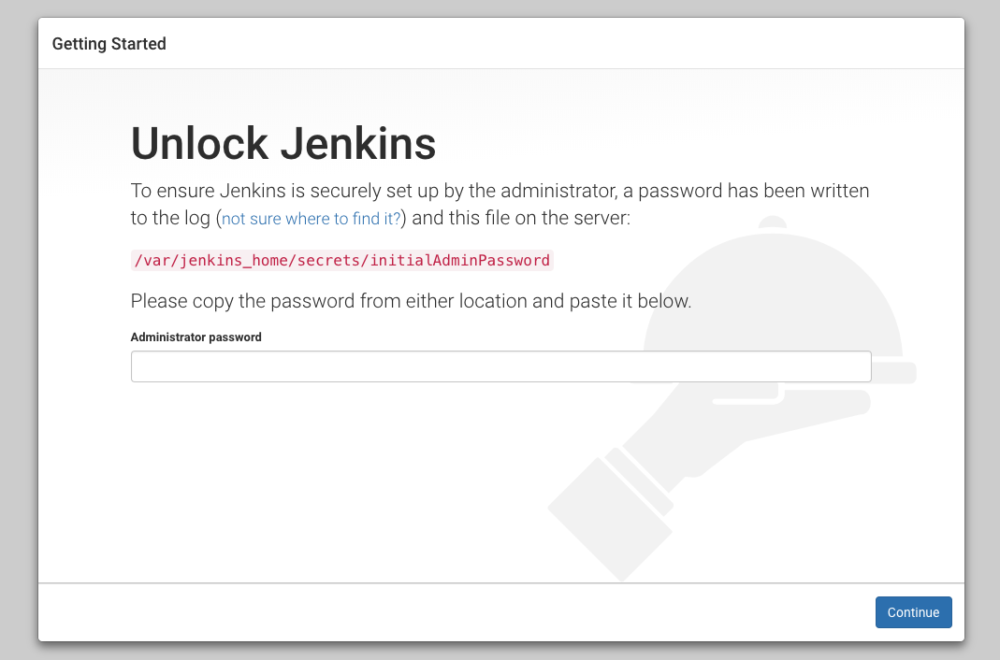
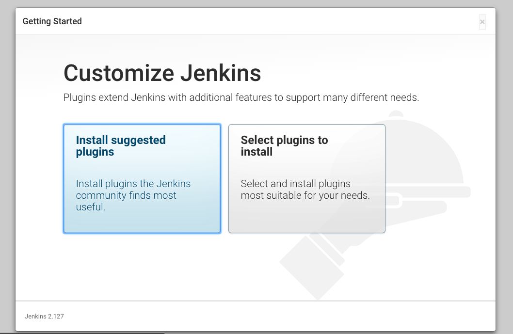
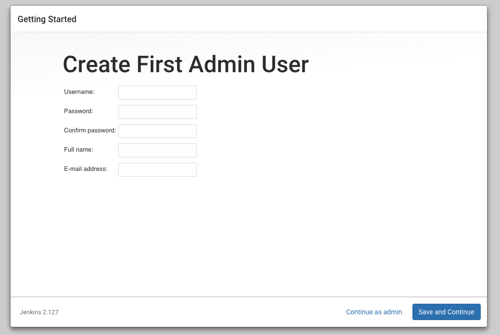
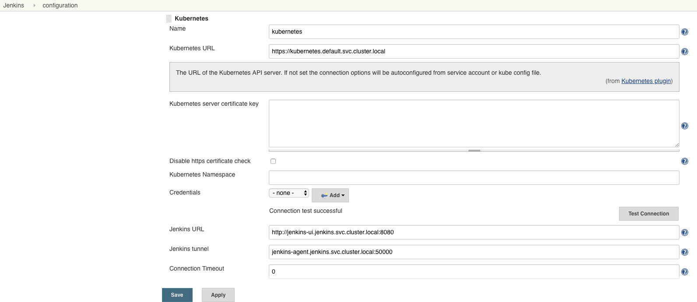
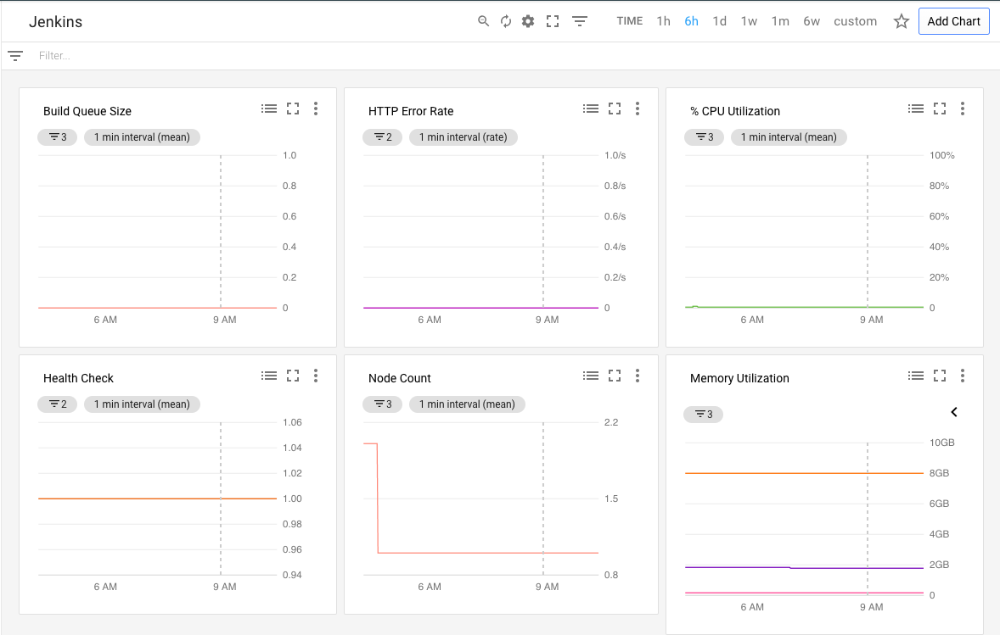
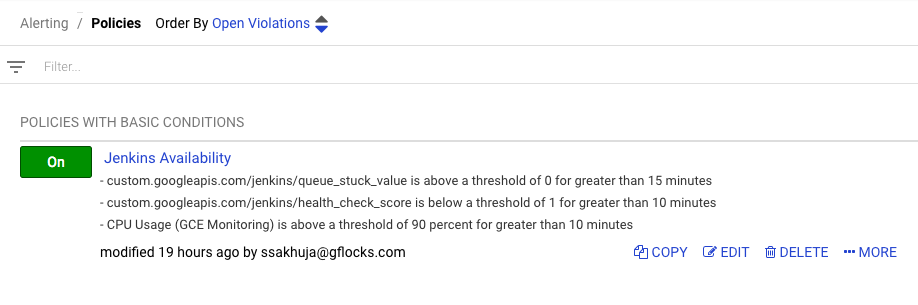

# Building a Jenkins CI Server and Deployment/Testing Environment

## Table of Contents

<!--ts-->
- [Building a Jenkins CI Server and Deployment/Testing Environment](#building-a-jenkins-ci-server-and-deploymenttesting-environment)
  - [Table of Contents](#table-of-contents)
  - [Introduction](#introduction)
  - [Architecture](#architecture)
    - [Jenkins Kubernetes Engine cluster](#jenkins-kubernetes-engine-cluster)
    - [Jenkins master deployment in Kubernetes](#jenkins-master-deployment-in-kubernetes)
    - [Jenkins plugins](#jenkins-plugins)
    - [Jenkins pipeline](#jenkins-pipeline)
  - [Prerequisites](#prerequisites)
    - [Tools](#tools)
    - [Versions](#versions)
    - [Configure Authentication](#configure-authentication)
  - [Deployment](#deployment)
    - [Create Jenkins Kubernetes Engine Cluster](#create-jenkins-kubernetes-engine-cluster)
    - [Access Jenkins UI and initial setup](#access-jenkins-ui-and-initial-setup)
    - [Create a private Jenkins node container image](#create-a-private-jenkins-node-container-image)
      - [Setup Kubernetes Plugin](#setup-kubernetes-plugin)
    - [Configure the Deployment Project](#configure-the-deployment-project)
    - [Configure Google OAuth authentication in GCP](#configure-google-oauth-authentication-in-gcp)
    - [Configure GitHub Integration in Jenkins](#configure-github-integration-in-jenkins)
    - [Configure Jenkins Jobs via DSL](#configure-jenkins-jobs-via-dsl)
    - [Monitoring Jenkins](#monitoring-jenkins)
  - [Enable Google TLS for Jenkins](#enable-google-tls-for-jenkins)
    - [create a TLS certificate](#create-a-tls-certificate)
    - [list TLS certifcates](#list-tls-certifcates)
    - [](#)
  - [Validation](#validation)
  - [Tear Down](#tear-down)
  - [Troubleshooting](#troubleshooting)
    - [Not have enough resources available to fulfill the request.](#not-have-enough-resources-available-to-fulfill-the-request)
    - [Jenkins build errors showing in console logs](#jenkins-build-errors-showing-in-console-logs)
  - [Relevant Material](#relevant-material)
<!--te-->

## Introduction

Jenkins is an open-source automation server that lets you flexibly orchestrate
your build, test, and deployment pipelines. Kubernetes Engine is a hosted
version of Kubernetes, a powerful cluster manager and orchestration system for
containers.

This guide will take you through the steps on how to setup
[Jenkins](https://jenkins.io/) running on a
[Kubernetes Engine](https://cloud.google.com/kubernetes-engine/) (Kubernetes Engine) Cluster.
The Jenkins cluster will be used to automatically build and test the current GitHub
projects as changes are merged in (i.e. Continuous Integration).
Jenkins build nodes will be dynamically provisioned into the Kubernetes cluster
so they will only be utilized when a build is actively running.  This will give
you ephemeral build nodes that allow each build to run in a clean environment
while freeing up resources when a build is not running.

## Architecture
We will be creating two separate Google Cloud projects.  Each project will be
running a Kubernetes Engine Cluster.  One cluster will be running Jenkins with the dynamically
provisioned build nodes.  The other clusters will be a development cluster that is used
to perform installation and validation of the built code.

Access to the Jenkins UI will be going through a Kubernetes ingress which
creates a public endpoint using the GCP load balancer with a self signed ssl
cert.

### Jenkins Kubernetes Engine cluster
When deploying a Kubernetes Engine cluster, we need to specify the scope
https://www.googleapis.com/auth/source.read_write so our cluster has access to
Cloud Source Repositories.

The Jenkins google-source-plugin requires the legacy scope
https://www.googleapis.com/auth/projecthosting so we will also include it.  An
upcoming release of that plugin should remove that dependency so only
https://www.googleapis.com/auth/source.read_write will be required.

This is done in the `create-jenkins-cluster.sh` build script by passing in the
`--scopes` flag to gcloud container clusters create
```shell
  gcloud container clusters create ${JENKINS_CLUSTER_NAME} \
    --cluster-version ${GKE_VERSION} \
    --num-nodes 3 \
    --enable-autorepair \
    --zone ${ZONE} \
    --scopes "https://www.googleapis.com/auth/source.read_write,https://www.googleapis.com/auth/projecthosting"
```

### Jenkins master deployment in Kubernetes
The following image describes the architecture for deploying Jenkins in a
multi-node Kubernetes cluster.



To setup the Jenkins master we will use the following Kubernetes resources:

- ConfigMap - Used to create a file with a list of necessary Jenkins plugins to
  install

- StatefulSet - Will be used to manage our deployment so Jenkins is stateful by
  saving data to a persistent volume

- RBAC - Using ServiceAccount, ClusterRole, and ClusterRoleBindings to set
  permissions

- Services - Service discovery for our UI and node agent communication

- Ingress - External load balancing and SSL termination for our external service

- Secrets - Secure storage of the SSL certificate and private keys for service
  accounts

### Jenkins plugins
The following Jenkins plugins will be required that are not part of the
`Install suggested Plugins` in setup.

- [Kubernetes Plugin](https://github.com/jenkinsci/kubernetes-plugin)
  (kubernetes) - Start Jenkins build executor containers in the Kubernetes
  cluster when builds are requested, terminate those containers when builds
  complete, freeing resources up for the rest of the cluster

- [Google Source Plugin](https://github.com/jenkinsci/google-source-plugin)
  (google-source-plugin) - This plugin provides the credential provider to use
  Google Cloud Platform OAuth Credentials

The plugins above will automatically be installed by a Kubernetes initContainers
during the Jenkins deployment.  To add more plugins to be automatically
installed add them to the manifests/jenkins-configmap.yaml file.  That file will
create a plugin.txt in a configmap that will get mounted to the Jenkins
container. The initContainers will run a script to install all plugins listed in
plugin.txt

### Jenkins pipeline
A [continuous delivery pipeline](https://jenkins.io/doc/book/pipeline/) will be
defined in a text file called a Jenkinsfile.  The Jenkinsfile can be committed
to a project's source control.  This is the foundation of "Pipeline-as-code"
which treats the pipeline as code therefore can be versioned and reviewed.

A Jenkinsfile can be written using two types of syntax: Declarative and
Scripted.  Our pipeline will be using the declarative pipeline syntax and will
also be used to define the build node in the Jenkins cluster.  The Kubernetes
plugin podTemplate is setup in the Jenkinsfile using yaml so we do not have to
configure it through the Jenkin UI.

The steps in our pipeline are:
1.  Set up the docker image version using the Jenkins build number

1.  Set up kubectl access to the deployment clusters using a service account in
    their project. The master branch will get access to the production cluster
    and all others will have access to the development cluster.

1.  Set up docker with credential to access the Google Container Registry in the
    Jenkins project

1.  Pull down the sample-app source code from Cloud Source Repositories

1.  Build the docker image

1.  Run test against that image

1.  Push the new version of the docker image to the Google Container Registry

1.  Update the docker image in the application's Kubernetes deployment manifest

1.  Use kubectl to deploy the application to the correct cluster

1.  Output the endpoint to access the sample application

1.  Revoke access to the service account

1.  Terminate the build node

## Prerequisites
A Google Cloud account and access to create two projects is required.  The projects
must have the proper quota to run a Kubernetes Engine cluster with n1-standard-4 nodes.

### Tools
1.  gcloud cli
1.  kubectl
1.  bash or bash compatible shell
1.  Docker
1.  git

### Versions
1.  Kubernetes Engine latest version
2.  kubectl that matches Kubernetes Engine version
3.  gcloud - Google Cloud SDK 200.0.0

More recent versions of all the tools may function, please feel free to file an
issue if you encounter problems with newer versions.

### Configure Authentication

The Terraform configuration will execute against your GCP environment and create various resources.  The script will use your personal account to build out these resources.  To setup the default account the script will use, run the following command to select the appropriate account:

`gcloud auth login`

## Deployment

Create two GCP projects. One for Jenkins, and another to host the deployment/testing of builds.  You can find instructions on how to create a project
[here](https://cloud.google.com/resource-manager/docs/creating-managing-projects)

### Create Jenkins Kubernetes Engine Cluster

Edit the file `scripts/jenkins.properties` and update these variables:
- `JENKINS_PROJECT` with the Jenkins GCP project ID.
- `DEV_PROJECT` with the deployment/testing GCP project ID.

Once the properties file is updated you next build the Jenkins Kubernetes Engine
cluster by executing the following script:
```shell
./scripts/create-jenkins-cluster.sh
```

This script will take 5-10 minutest to complete.  Once it completes the last few lines of the output will look similar to this:
```shell
waiting for external ip from ingress

 Access Jenkins using this url https://<your external ip>
```

Take the URL and navigate to it in your browser.  If the url doesn't load it could be that we are still waiting for the
load balancer to pass it's health checks. To check on the status, go to
the cloud console and then go to `Network services` -> `Load balancing` and then
click on the jenkins load balancer.  In the backend services section, wait until
the healthy column has 1/1 for all the nodes.

### Access Jenkins UI and initial setup

You will get a connection is not private warning since we're using a self signed certificate.  Since this is your first time
accessing Jenkins, it will prompt you to "Unlock Jenkins".



To get your initial Administrator password for Jenkins execute the following script
```shell
./scripts/get-jenkins-password.sh
```

Copy the returned value to the `Administrator password` box and hit the continue
button.

In the next screen `Customize Jenkins` click on the `Install suggested Plugins`
box. The list of installed suggested plugins can be found [here](https://github.com/jenkinsci/jenkins/blob/master/core/src/main/resources/jenkins/install/platform-plugins.json)



Complete the information to create the first admin user and then hit the
`Save and Continue` button. Use a secure password since this url is publicly
exposed.



On the next screen `Instance Configuration` the `Jenkins URL:` field should
already be populated so just hit `Save and Finish` and then the
`Start using Jenkins` button.

### Create a private Jenkins node container image

We will now create our own Jenkins node image based off the Jenkins image
[jenkins/jnlp-slave](https://github.com/jenkinsci/docker-jnlp-slave).  Our
Dockerfile adds the Google Cloud SDK to the image.

To create the container image execute the following script:
```shell
./scripts/create-jenkins-node-container.sh
```

The `jenkins-k8s-node` image is now ready to be pulled from your private docker
registry.  You can also still choose to pull from the public registry at
gcr.io/pso-examples/jenkins-k8s-node

#### Setup Kubernetes Plugin

1.  Go to the main page and click on `Manage Jenkins` on the left

1.  Click on `Configure System` and scroll all the way to the bottom until you
    see the `Cloud` section

1.  Click on the `Add a new cloud` drop-down and select `Kubernetes`

1.  In the `Kubernetes URL` field enter in
    `https://kubernetes.default.svc.cluster.local`

1.  In the `Jenkins URL` field enter in
    `http://jenkins-ui.jenkins.svc.cluster.local:8080`

1.  In the `Jenkins tunnel` field enter in
    `jenkins-agent.jenkins.svc.cluster.local:50000`. This will allow the Jenkins
    build nodes to use this endpoint to communicate back to the master

1.  You can click on the `Test Connection` button to validate that Jenkins has
    access to Kubernetes in the cluster

1.  Click on the 'Save' button




### Configure the Deployment Project

We will be building one Kubernetes Engine clusters `development` (dev) to use for
building projects from GitHub.  The cluster will be in it's own GCP project.

To build the deployment clusters you will need to execute the
`create-deployment-cluster.sh` script and pass in the environment with -e.  The
script will read in the DEV_PROJECT and PROD_PROJECT variables from the
`scripts/jenkins.properties` file.  Run the scripts one at a time.

To configure the development project execute the following script:
```shell
./scripts/configure-dev.sh
```

A service account private key will be created and saved in the root directory
with the name set to the variable SA_NAME.json .  The script will then switch
over to your Jenkins Kubernetes cluster context and add that file as a secret in
the Jenkins cluster.

### Configure Google OAuth authentication in GCP

The next step in the process is to change the authentication method for accessing
Jenkins.  By default Jenkins manages authentication via an interal database of
user names and passwords.  To support simple login management for end users we
can reconfigure this to use Google OAuth and leverage users gflocks.com logins.
To perform this configuration please follow the steps in the following writeup:
http://www.tothenew.com/blog/jenkins-google-authentication/

### Configure GitHub Integration in Jenkins

To support builds integrated with GitHub (i.e. initiated from Pull Requests) we
need to configure integration with GitHub with credentials that allow access.  To
do this we need to complete the following steps:

1. In this configuration we are going to use a personal access token for an accounts that has access to the GitHub repositories.  If you don't already have an account with a PAT then follow the steps outlined on this page: https://help.github.com/articles/creating-a-personal-access-token-for-the-command-line/
2. Once you have a PAT, go into Jenkins and click the 'Manage Jenkins' link.
3. Next click on the 'Configure System' link.
4. In the GitHub section you need to configure access to the GitHub server using the following parameter:
  1. Name : github
  2. API URL : https://api.github.com
5. Next click on the 'Add' button next to credentials.
6. On the add page change the 'Kind' field to be 'Secret Text'.
7. Next enter the Personal Access Token into the 'Secret' field.
8. For the 'ID' field you can enter a name specifying what the account is that you are using.  Probably put the account name for this.
9. Click the 'Add' button to save the change.
10. Click on the 'Test Connection' button to verify that everything was configured properly.
11. Click the 'Save' button to save the configuration changes.

At this point there shouldn't be anything else to do.

### Configure Jenkins Jobs via DSL

The existing Jenkins jobs for the various GitHub projects can be created and configured
by completing one configuration and executing the job.  Each of the projects has a
Jenkins Job DSL configuration setup that can be retrieved from a GCP Source Repository.
To perform this configuration complete the following steps:

1. On the Jenkins Menu click 'New Item'.
2. On the new item screen enter a name of 'seed' and select the 'Freestyle project' item type.  Click the 'Ok' button to continue.
3. On the new item page do the following configuration:
  1. In 'Source Code Management' select the 'Git' option.
  2. For the repository enter the following URL: https://source.developers.google.com/p/pso-helmsman-cicd/r/jenkins-job-dsl.git
  3. Setup the credentials to authenticate with by clicking the 'Add' button, and specifiying to use the Kind of 'Google Service Account from metadata'.  This will create a service account you can find in IAM on the Jenkins server that has a name similar to '<Number>-compute@developer.gserviceaccount.com' (This account will be used later).
  4. In the 'Build' section click on the 'Add Build Step' and select the 'Process Job DSLs' option.
  5. In this section enter '*.groovy' for the 'DSL Scripts' field.
  6. Click the 'Save' button to create the new item.
4. The service account created in the step above will need to be given a minimum of 'Viewer' permissions in the 'jenkins-job-dsl' source repository to be able to pull the DSL scripts from the repository.  To do this perform the following steps:
  1. Navigate to the pso-helmsman-cicd project.
  2. Navigate to the 'Source Repositories' section in the console.
  3. Click on 'Repositories' on the left nav, and put a check next to the 'jenkins-job-dsl' repository in the list.
  4. This brings up the 'Permissions' section on the right.  Enter in the service account, select the 'Viewer' role, and click the 'Add' button.
5. Navigate to the 'Configure Global Security' section of Jenkins.
  1. In the 'Access Control for Builds' section add a 'Per-project configurable Build Authorization'.
  2. In this section uncheck the 'Run as anonymous'.
  3. Click the 'Save' button to save the configuration changes.
6. Additionally you have to go back in the 'seed' item and go to the 'Authorization' page.
  1. On this page select the 'Configure Build Authorization', and specify the 'Authorize Strategy' to be 'Run as User who Triggered Build'.
7. On the main Jenkins home page, click on the 'Schedule a Build' icon for the 'seed' item you just created.  Within a short time you should see a number of 'gke' jobs filling into the screen.
8. Once all of the 'gke' jobs are created you need to next go in to them and verify the default parameters to ensure that they are configured correctly for your environment (most likely they are not for a new environment).  To do this preform the following steps:
  1. Click on the job's name link.
  2. On the left navigation click on the 'Configure' link.
  3. Review the section with 'This project is parameterized'.  You should primarily be looking at the Zones, Regions, and Projects used to build and test the project.  These will need to correspond to the details of the Deployment server you created and configured earlier.
  4. Click 'Save' if you made any changes that need to be persisted.
  5. Complete the same process for each of the jobs.

### Monitoring Jenkins
The `jenkins-statefulset.yaml` definition includes a sidecar container `prometheus-to-sd` which scrapes prometheus metrics from the jenkins container at a regular interval and pushes them to Stackdriver. These metrics are served by jenkins at the path `/prometheus`. Note that there is a [bug](https://github.com/GoogleCloudPlatform/k8s-stackdriver/issues/196) currently preventing metrics of type SUMMARY from successfully being pushed to Stackdriver.

A basic dashboard has been created in Stackdriver for the `pso-helmsman-cicd` GCP Project as shown below.


Alerts have also been configured to email the Helmsman team upon key metric thresholds being surpassed.


## Enable Google TLS for Jenkins

### create a TLS certificate
```
gcloud beta compute ssl-certificates create ci-gflocks --domains ci.gflocks.com --project pso-helmsman-cicd
```

### list TLS certifcates 
```
gcloud beta compute ssl-certificates list --project pso-helmsman-cicd
```

### 
```
gcloud beta compute ssl-certificates describe ci-gflocks --project pso-helmsman-cicd
``` 

## Validation

Once you have completed all of the above steps and have configured GKE items already
to build we are ready to validate that everything is correctly configured and
working in the environment.  To do this we can simply click on the 'Schedule a Build'
icon for one of the 'GKE' items in the list (such as gke-monitoring-tutorial).  If
everything is configured properly this build should pull the source from GitHub,
build the code, and test it successfully.

## Tear Down
For these instructions a 'Tear Down' is not going to be utilized, because the intention
is to build an environment that exists permanently to execute the builds and tests
as changes are merged.

## Troubleshooting

### Not have enough resources available to fulfill the request.
If you see the error below while running a create cluster script:

```shell
ERROR: (gcloud.container.clusters.create) Operation [<Operation
 endTime: u'2018-06-11T15:07:31.629011889Z'
 name: u'operation-1528729580815-7bfb2d8a'
 operationType: OperationTypeValueValuesEnum(CREATE_CLUSTER, 1)
 selfLink: u'https://container.googleapis.com/v1/projects/213006730541/locations/us-east1/operations/operation-1528729580815-7bfb2d8a'
 startTime: u'2018-06-11T15:06:20.815415248Z'
 status: StatusValueValuesEnum(DONE, 3)
 statusMessage: u'Google Compute Engine: us-east1-a does not have enough resources available to fulfill the request. Try a different location, or try again later.'
 targetLink: u'https://container.googleapis.com/v1/projects/213006730541/locations/us-east1/clusters/jenkins-poc'
 zone: u'us-east1'>] finished with error: Google Compute Engine: us-east1-a does not have enough resources available to fulfill the request. Try a different location, or try again later.
```

You can delete the cluster wait and try again or switch your zone in the
jenkins.properties file

### Jenkins build errors showing in console logs

- get-credentials error:

  ```shell
  Fetching cluster endpoint and auth data.
  ERROR: (gcloud.container.clusters.get-credentials) ResponseError: code=403,
  message=Required "container.clusters.get"
  ```

  This means the permissions on the service account running in the Jenkins
  node is not synced up correctly with the role in the Jenkins project.

  Solution:

  Run the delete-deployment-cluster.sh script against that cluster to remove the
  cluser and service account and then run create-deployment-cluster.sh to
  recreate the cluster and service account again.

- docker push error:

  ```shell
  denied: Token exchange failed for project '<jenkins project>'. Caller does
  not have permission 'storage.buckets.get'. To configure permissions, follow
  instructions at: https://cloud.google.com/container-registry/docs/access-control
  ```

  The Jenkins service account for your deployment cluster no longer has access
  to the storage bucket containing your container registry.

  Solution:

  In your GCP console go to the storage bucket
  artifacts.{your jenkins project}.appspot.com and then edit the bucket
  permissions and remove your deployment clusters jenkins service account from
  the Storage Admin role and readd it.

## Relevant Material

1.  [Lab: Build a Continuous Deployment Pipeline with Jenkins and Kubernetes][1]
2.  [Jenkins Kubernetes Plugin][2]
3.  [Jenkins on Kubernetes Engine][3]
4.  [Setting up Jenkins on Kubernetes Engine][4]
5.  [Configuring Jenkins for Kubernetes Engine][5]
6.  [Continuous Deployment to Kubernetes Engine using Jenkins][6]

[1]: https://github.com/GoogleCloudPlatform/continuous-deployment-on-kubernetes
[2]: https://github.com/jenkinsci/kubernetes-plugin
[3]: https://cloud.google.com/solutions/jenkins-on-kubernetes-engine
[4]: https://cloud.google.com/solutions/jenkins-on-kubernetes-engine-tutorial
[5]: https://cloud.google.com/solutions/configuring-jenkins-kubernetes-engine
[6]: https://cloud.google.com/solutions/continuous-delivery-jenkins-kubernetes-engine
